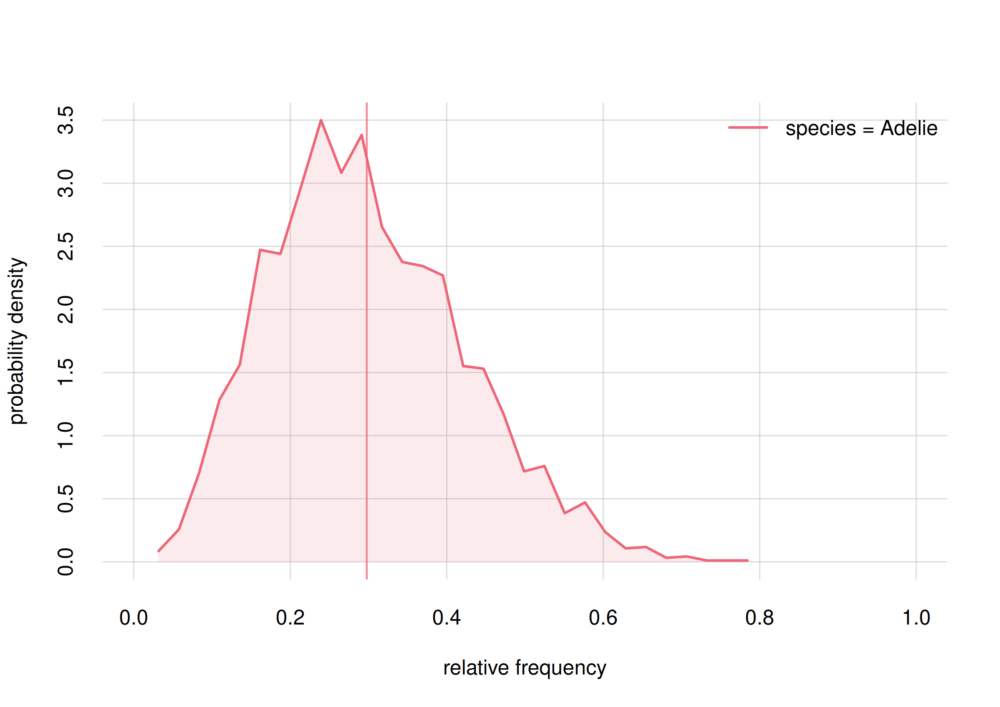
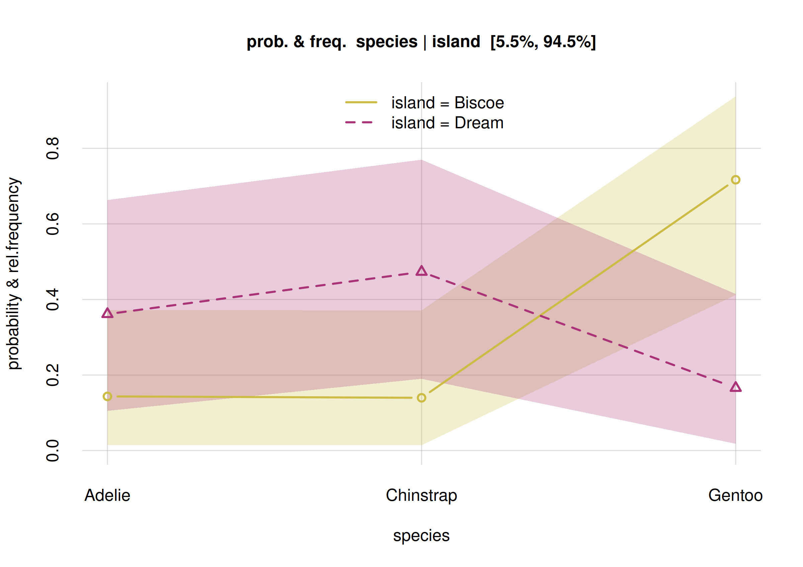
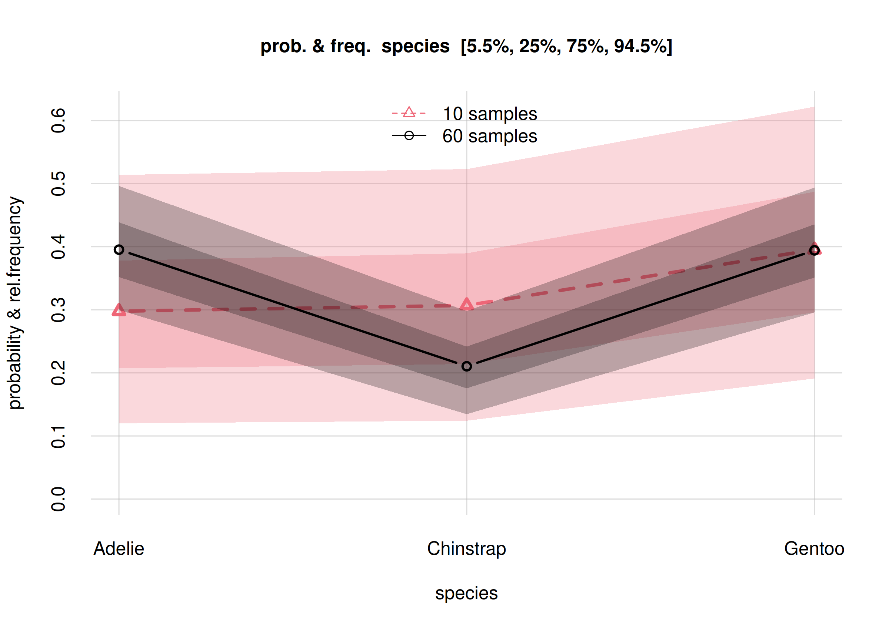
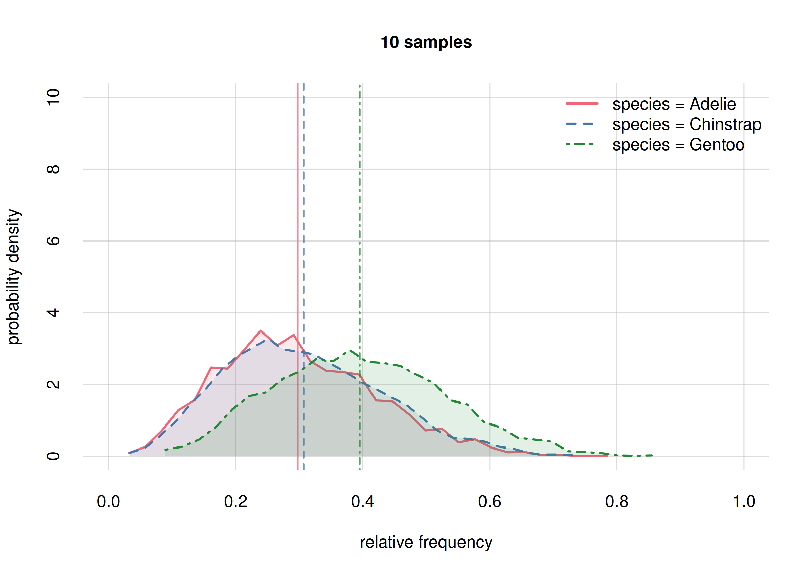
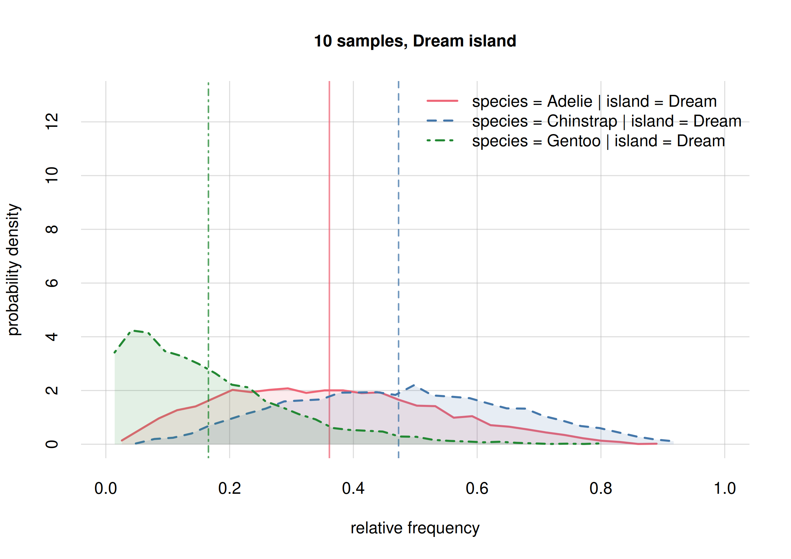
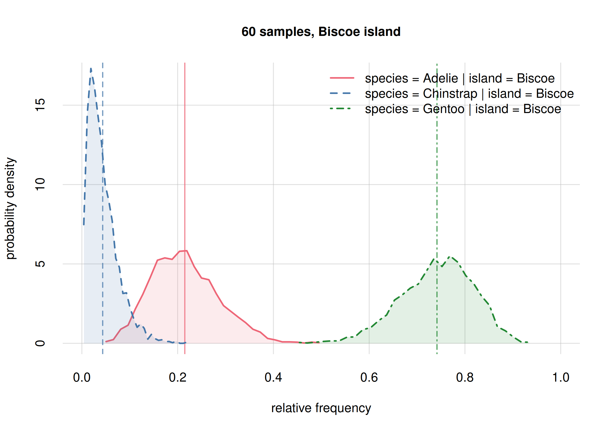
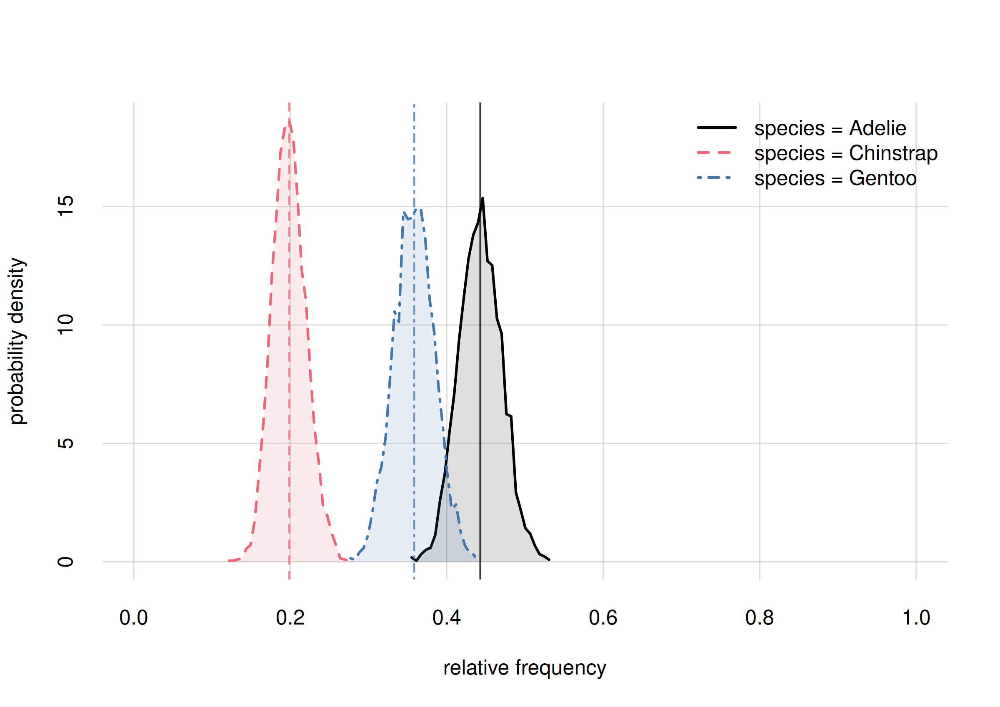
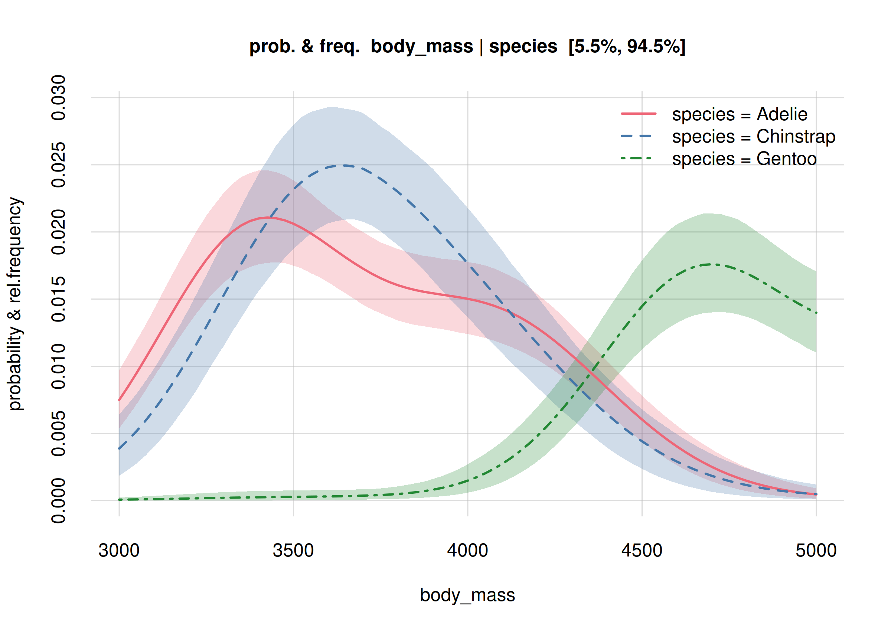

This vignette gives an introduction and guide to the kinds of *Bayesian nonparametric inference* that can be done with ***inferno***, by means of a concrete example. It also has the purpose to clarify the terminology used in the ***inferno*** package.

\

# Before we start

It is of course impossible to summarize this branch of probability theory and of statistics in a couple of sections; you're invited to learn more for instance from the texts given in the [references](#references).

Two extremely important warnings before you follow the example:

- Some terms may sound familiar to you, but keep in mind that they may have quite different meanings from what you're used to. This is especially true of the terms in **boldface**. When you see a term in **boldface**, try to understand its meaning from the way it's used, rather than assuming the meaning familiar to you.  Different methods and different disciplines unfortunately use the same terms in different ways.

  In particular keep in mind that the term **probability** does *not* mean **frequency**. 'Probability' means 'plausibility', or 'credibility', or 'degree of belief': it is a quantification of our uncertainty about some possible fact. There is a connection between probability and frequency, but they are not the same. This distinction is important, because one of the main problems in statistical inference is that *we are uncertain about the frequency of something* -- the occurrence of a disease, of a symptom, or of other characteristics -- and our goal is to quantify and reduce that uncertainty as much as possible. The frequency of something in a population or group or collection is a static value, often unknown. Probability is something dynamic: it updates when new information becomes available.

- The example that follows is, like every example, very specific. But *try to see the more general, abstract picture behind it*, and to see how its general methodology could be applied to your own research. From time to time we shall draw analogies with other examples that may look very different and yet use essentially the same methodology.

\
You're now welcome to open R in your favourite integrated development environment, choose a directory to work in, and test yourself the code that follows. Let's start by loading the ***inferno*** package:


``` r
library('inferno')
```

In our example we shall use data from the `penguins` dataset, included in R version 4.5.0 and above. We shuffle this dataset to erase any particular ordering of its data, and call the new dataset `penguin` (without the final 's'). For your convenience you can download the shuffled dataset as the CSV file [`penguin_data.csv`](https://github.com/pglpm/inferno/raw/main/development/downloads/penguin_data.csv). Otherwise you can create such file from R 4.5.0 or above as follows:


``` r
set.seed(50) ## replace with your favourite seed number

penguin <- penguins[sample(1:nrow(penguins)), ] ## shuffle

write.csvi(penguin, file = 'penguin_data.csv')
```

The utility function `write.csvi()` saves the dataset as a CSV file that respects the [formatting rules required by ***inferno***](#format).

We assume that you now have the `penguin_data.csv` file.

\

# Penguins

We are researchers interested in penguins; specifically the **population** living in the Antarctic islands *Biscoe*, *Dream*, *Torgersen*. Our research questions are not yet precisely defined, but some initial questions of interest are the following. The penguins can be of three species: [*Adélie*](https://www.bas.ac.uk/about/antarctica/wildlife/penguins/adelie-penguin/), [*Chinstrap*](https://www.bas.ac.uk/about/antarctica/wildlife/penguins/chinstrap-penguin/), [*Gentoo*](https://www.bas.ac.uk/about/antarctica/wildlife/penguins/gentoo-penguin/); we'd like to know:

Q1
: What's the overall statistical occurrence of the three species, independently of location or other details? In other words, what is the relative frequency of each species in the population?

Q2
: Do the three species differ, *statistically*, in some physical or geographical characteristic such as sex or island of origin? We say "statistically" because, for instance, there surely are females and males of every species, but it's possible that for one of the species the ratio of females to males is higher than for another species.

Q3
: Is there a physical or geographical characteristic that allows us to make a good guess about a penguin's species? We say "guess" because, for instance, from knowing which island a penguin comes from we can't be 100% sure about that penguin's species.

In order to approach these and other future questions, we decide which set of penguin characteristics we should consider and observe. These characteristics are called the **variates** of the population. This set can be extended or reduced later on. Guided by previous studies, or by some hypotheses we are entertaining, we choose the following variates, each denoted by a short `codeword`:

- Species (`species`)
- Island (`island`)
- Bill length (`bill_len`): [the length of a penguin's "beak"](https://allisonhorst.github.io/palmerpenguins/reference/figures/culmen_depth.png) in millimetres
- Bill depth (`bill_dep`): [the depth of a penguin's "beak"](https://allisonhorst.github.io/palmerpenguins/reference/figures/culmen_depth.png) in millimetres
- Flipper length (`flipper_len`): the length of a penguin's "wing" in millimetres
- Body mass (`body_mass`) in grams
- Sex (`sex`)
- Study year (`year`): the year a penguin was observed and measured

We include the last variate because there could be time trends in the values we observe. For instance, a particular species might have more females than males during one year, and vice versa during another year.


## "Population"?

The question of time-trends leads us to more general considerations and questions about statistical research, which unfortunately are often forgotten.

To start with: this "population" which we want to study, how is it defined exactly? What counts as a member of the population, and what doesn't? For example, a seal clearly doesn't count, because it isn't a penguin. A penguin from the Galápagos island doesn't count either, because it isn't from one of the three Antarctic islands we specified. But does a penguin who was alive in the year 1830 count? what about one who will live in those islands in the year 2100? Does a penguin with some kind of notable physical impairment count? Does a penguin who only lived 1 year count? Does a penguin born in the Galápagos island but subsequently transported to the Antarctic islands count?

No matter which research field you work in, you realize that analogous questions appear when you try to define the "population" in some study.

It is practically impossible to specify an exact criterion for membership in a population under study. We may try to cover and delimit as many factors as possible, but there may always appear a new one we didn't think of. There's no "objective" specification of a population: the specification depends on our research purpose -- which often is not precisely specified either. We must therefore always be prepared to further specify the population of our study. In some cases we may even need to modify our previous specification, and thus discard some data or acquire new ones.

The intrinsic and unavoidable problem in the specification of a population has important consequences for the way we observe and measure the population and its variates. We now turn to this problem.

## Sampling

Our questions **Q1**, **Q2**, **Q3** could have *exact statistical answers* if we had a *complete census* of the penguin population; that is, if we went and "measured" the values of the variates in each and every penguin of the population.

To make this point clearer, imagine a slightly different population. Suppose we were interested only in all the penguins alive today on a specific, very small island. The island turns out to have 17 penguins. We check all of them. We find that 6 of these are females, and 11 are males. It's then a fact that 6/17${}\approx{}$35.3% of penguins in this specific population are females, and 64.7% are males. And if someone picked a penguin from this population and asked us to guess its sex, we would give a 35.3% probability to that penguin's being female, and 64.7% to its being male.^[Note the difference between probability and frequency. If an expert colleague tells us "I was able to take a quick look at that penguin, and it looks female to me, though I'm not completely sure", then our *probability* that this specific penguin is female would get higher than 50%. If we observe the penguin and see that it's female, our probability for female would become 100%.  Yet the *frequency* of females in the population is still 35.3%.]

But it is often impractical or impossible to take a complete census. Think of the case were the whole population includes members or variates that will only exist in the future. For this reason we proceed as follows: we observe a **sample** of the whole population, and from the study of this sample we try to infer the statistical properties of the whole population. Our inferences are perforce uncertain: we can't be fully sure about the exact statistical properties of the whole population. The essential point is that our uncertainty is not just a matter of "I don't know" versus "I know":

- we can *quantify* our uncertainty;
- we can *reduce* our uncertainty, sometimes to the point where it becomes almost a certainty.

Some trusted colleagues thus go to the three islands, and examine samples of penguins there, sending back the values they observe. The way they do the sampling would require a deep analysis and discussion, but for the moment we put these aside.

How many samples should our colleagues collect? The short answer is: as many as they can. The more samples we have, the more certain our conclusions will be -- all kinds of conclusions: for instance those that may reveal the presence, as well as those that may reveal the absence, of important associations.

One important feature of Bayesian inference is that *we don't need to choose beforehand when to stop sampling*. We can monitor the results as more and more samples arrive, and stop as soon as the level of certainty about the results is satisfactory. This is possible because in Bayesian inference the *sample size affects only the uncertainty* we have of the ground truth -- association, effect, or other hypothesis -- but *it cannot affect the ground truth itself*. If the truth is that "there is no effect", then this truth will come to light with more and more certainty as we increase the sample size, and no amount of sampling will be able to change this truth.

\

# How to use the sample data

## A first, preliminary analysis

Imagine that, a while after the sampling begun, our colleagues start sending the collected sample data to us, a little batch at a time. For the moment we assume that the batches are chosen without any systematic order; in particular, their order is unrelated to the time of sampling. We make this assumption in order to avoid trends, which we'll discuss in another vignette.

We receive the first 10 samples from our sampling survey and store them in the file `penguin_data10.csv`, respecting the [formatting rules required by ***inferno***](#format):


``` r
datafile <- 'penguin_data10.csv'
write.csvi(penguin[1:10, ], datafile) ## write the first 10 samples
```

Here they are:


|   |species   |island    | bill_len| bill_dep| flipper_len| body_mass|sex    | year|
|:--|:---------|:---------|--------:|--------:|-----------:|---------:|:------|----:|
|1  |Adelie    |Torgersen |     37.8|     17.1|         186|      3300|       | 2007|
|2  |Chinstrap |Dream     |     54.2|     20.8|         201|      4300|male   | 2008|
|3  |Adelie    |Dream     |     36.2|     17.3|         187|      3300|female | 2008|
|4  |Chinstrap |Dream     |     52.0|     19.0|         197|      4150|male   | 2007|
|5  |Gentoo    |Biscoe    |     45.3|     13.7|         210|      4300|female | 2008|
|6  |Gentoo    |Biscoe    |         |         |            |          |       | 2009|
|7  |Adelie    |Torgersen |     42.5|     20.7|         197|      4500|male   | 2007|
|8  |Gentoo    |Biscoe    |     48.5|     15.0|         219|      4850|female | 2009|
|9  |Chinstrap |Dream     |     46.5|     17.9|         192|      3500|female | 2007|
|10 |Gentoo    |Biscoe    |     46.9|     14.6|         222|      4875|female | 2009|


If you generated the `penguin` dataset yourself, then your first 10 samples may be different.

In the data above, samples #1 and #6 have one or more missing variates. But incomplete data are not a problem: inferences can still be performed from them, because Bayesian methods and ***inferno*** automatically perform *imputation* of missing data, and they do so in a principled way (via the marginalization rule of probability theory).

With these datapoints we start our Bayesian nonparametric analysis using ***inferno***! 

There are now two preliminary steps, which we must usually follow to perform an analysis:

1. Determine and prepare the **metadata** about the variates of interest.
2. Perform the general inference about the whole population from the sampled data; we shall call this **learning** from the sample data.

## Metadata preparation

Metadata are "data about the data". They must be provided in a CSV file respecting the [formatting rules](#format), or as a `data.frame`, and consist of around eight pieces of information about the variates of our population:

Variate name (`name`)
: This is a character or string: name of a variate. Different variates should obviously have different names.


Variate type (`type`)
: ***inferno*** can handle three kinds of variates:
    
    - `nominal`: it can take on a finite number of discrete values, which do not have any natural ordering. Examples could be sex or geographical location.
    - `ordinal`: it can take on a finite number of discrete values, which do have a natural ordering. They can be qualitative or numeric. Examples could be the degree of satisfaction of a customer, or the severity of a disease, or a [Likert scale](https://www.britannica.com/topic/Likert-Scale).
    - `continuous`: it can in principle take on an infinite number of continuous values, although they can be discretized or rounded. Examples could be age or weight.
    
    Many other types of variates exist. For example images and audio are also types of variates; but ***inferno*** cannot handle these complex types. A simple type of variate that ***inferno*** cannot properly handle is the *cyclic* one, such as time of day. There are no clear-cut separations between different types of variates; thus it's sometimes difficult to assess the type.


Domain minimum and maximum (`domainmin`, `domainmax`)
: These are numbers, only defined for numeric-ordinal and continuous variates. These metadata are the minimum and maximum value a variate can take on in a given study. For example, in a study about health or employment of adults, a variate *age* might have a minimum of 18 years. In a more general study involving people of all ages, the minimum would be 0. In a health study where people of 90 years or more are pooled together, the maximum would be 90 years. A minimum could also be minus-infinity, and a maximum plus-infinity. Obviously the minimum should be lower than the maximum.
    
    Sometimes the minimum or maximum is not clear-cut. For instance, there is no theoretical maximum on a person's age, although we can consider an age of 300 impossible to reach today. In such cases the maximum or minimum can be taken to be plus or minus infinity.

Interval between values (`datastep`)
: This is a positive number, only defined for numeric-ordinal and continuous variates. It is the separation between consecutive values. For example, in a 1--5 Likert-scale variate, the interval is 1. For an *age* variate expressed in and rounded to years, the interval is 1. For a *length* variate expressed in centimetres and rounded to millimetres, the interval is 0.1.

Inclusion of inimum and maximum (`minincluded`, `maxincluded`)
: These are logical or `yes`/`no`, only defined for continuous variates. They tell whether the minimum and maximum of a continuous variate are themselves possible values or not. Often such extreme values have a special meaning, and this information is important with censored or pooled data. For example, a *length* continuous variate might be expressed in decimetres and reported without rounding, but all lengths above 1 dm might be pooled together into the value "1 dm or more"; in such case we must make sure to state that `maxincluded` is `TRUE` or `"yes"`.

Values (`V1`, `V2`, ...)
: These are characters or strings, only defined for nominal or non-numeric ordinal variates. They are the values that a nominal or ordinal variate can *in principle* take on in the population of interest. Note that they are include not only the values that are observed in a sample, but also those that could be observed in the rest of the population. A nominal or ordinal variate must have at least two distinct values; it wouldn't make much sense to draw inferences about it otherwise. The metadata file can contain further empty **V...** columns.

### Why does ***inferno*** need metadata?

Because it performs *nonparametric* inference. In other words, it does not assume the frequency distribution of the variates in the whole population to have any specific class of shapes, such as a Gaussians; nor does it assume any functional relation at all, as instead is the case for, say, linear regression. Bayesian nonparametric population inference and ***inferno*** try to extrapolate the frequency distribution of the whole population from the sample data provided. We must therefore provide to ***inferno*** the same general information that we ourselves have about the variates, and about any artificial modifications performed on their values, such as rounding or pooling.

In order to prepare the metadata file we can use ***inferno***'s `metadatatemplate()` helper function. This function reads the sample data and prepares a preliminary file containing heuristic *guesses* about the metadata. We must then check and correct this file. The function motivates its guesses and warns about especially uncertain ones. Here is the code to generate a `penguin_metadata.csv` file, and the output and warnings of the helper function:


``` r
metadatafile <- 'penguin_metadata.csv'

metadatatemplate(data = datafile, file = metadatafile)
# Analyzing 8 variates for 10 datapoints.
# 
# * "species" variate:
#   -  3 different  values detected:
#  "Adelie", "Chinstrap", "Gentoo" 
#   which do not seem to refer to an ordered scale.
#   Assuming variate to be NOMINAL.
# 
# * "island" variate:
#   -  3 different  values detected:
#  "Biscoe", "Dream", "Torgersen" 
#   which do not seem to refer to an ordered scale.
#   Assuming variate to be NOMINAL.
# 
# * "bill_len" variate:
#   - Numeric values between 36.2 and 54.2 
#   Assuming variate to be CONTINUOUS.
#   - Distance between datapoints is a multiple of 0.1 
#   Assuming variate to be ROUNDED.
#   - All values are positive
#   Assuming "domainmin" to be 0
# 
# * "bill_dep" variate:
#   - Numeric values between 13.7 and 20.8 
#   Assuming variate to be CONTINUOUS.
#   - Distance between datapoints is a multiple of 0.1 
#   Assuming variate to be ROUNDED.
#   - All values are positive
#   Assuming "domainmin" to be 0
# 
# * "flipper_len" variate:
#   - Only 8 different numeric values detected:
# from 186 to 222 in steps of 1 
#   Assuming variate to be ORDINAL.
# 
# * "body_mass" variate:
#   - Only 7 different numeric values detected:
# from 3300 to 4875 in steps of 25 
#   Assuming variate to be ORDINAL.
# 
# * "sex" variate:
#   -  2 different  values detected:
#  "female", "male" 
#   which do not seem to refer to an ordered scale.
#   Assuming variate to be NOMINAL.
# 
# * "year" variate:
#   - Only 3 different numeric values detected:
# from 2007 to 2009 in steps of 1 
#   Assuming variate to be ORDINAL.
# 
# =========
# WARNINGS - please make sure to check these variates in the metadata file:
# 
# * "year" variate appears to have been rounded
# and then transformed to logarithmic scale.
# This may lead to problems in the inference.
# Preferably, transform it back to non-logarithmic scale.
# =========
# 
# Saved proposal metadata file as "penguin_metadata.csv" 
```

The preliminary metadata file created by `metadatatemplate()` looks like this:


|name        |type       | domainmin| domainmax| datastep| minincluded| maxincluded|V1     |V2        |V3        | V4| V5| V6| V7| V8| V9| V10| V11|
|:-----------|:----------|---------:|---------:|--------:|-----------:|-----------:|:------|:---------|:---------|--:|--:|--:|--:|--:|--:|---:|---:|
|species     |nominal    |          |          |         |            |            |Adelie |Chinstrap |Gentoo    |   |   |   |   |   |   |    |    |
|island      |nominal    |          |          |         |            |            |Biscoe |Dream     |Torgersen |   |   |   |   |   |   |    |    |
|bill_len    |continuous |         0|          |      0.1|            |            |       |          |          |   |   |   |   |   |   |    |    |
|bill_dep    |continuous |         0|          |      0.1|            |            |       |          |          |   |   |   |   |   |   |    |    |
|flipper_len |ordinal    |       186|       222|      1.0|            |            |       |          |          |   |   |   |   |   |   |    |    |
|body_mass   |ordinal    |      3300|      4875|     25.0|            |            |       |          |          |   |   |   |   |   |   |    |    |
|sex         |nominal    |          |          |         |            |            |female |male      |          |   |   |   |   |   |   |    |    |
|year        |ordinal    |      2007|      2009|      1.0|            |            |       |          |          |   |   |   |   |   |   |    |    |


If you generated the `penguin` dataset yourself, then you might obtain different guesses. Try to follow the following guidelines for the present example.

We see that `metadatatemplate()` guessed correctly about the `species`, `island`, `sex` variates: they are of `'nominal'` type, and all their possible values are correctly listed. If any of the possible values are missing from the sample, and therefore missing in the preliminary metadata, then we should add them under the  additional **V...** columns. Note that we can sort the nominal values in any order we please.

Also the `bill_len` and `bill_dep` variates are correct: they are continuous, rounded to the nearest tenth of millimetre, and cannot be less than zero. The absence of **domainmax** values means that the theoretical maximum is plus infinity. We could replace this maximum with something more realistic, for instance `1000` mm or less, but typically this kind of changes do not lead to relevant differences in our inferences. The absence of **minincluded** means that the minimum, `0`, is not a possible value; similarly for **maxincluded**.

The `year` variate is correctly classified as ordinal, with values between 2007 and 2009. If the sampling had a later end date, we would correct the 2009 value. The `year` variate could alternatively be considered continuous and rounded; in the present case this alternative classification wouldn't affect our inferences: ***inferno*** treats this kind of ambiguous cases in the same way.

Also the `sex` variate is correctly guessed: `nominal` type with possible values `'female'` and `'male'`.

\
The guesses about the `flipper_len` and `body_mass` variates are not correct, however: these variates are continuous, with a minimal value of `0` and no maximal value. They are rounded to `1` mm and `25` g (this was correctly guessed).

We must open the preliminary metadata file `penguin_metadata.csv` with our favourite editor, and correct and complete the guesses of the helper function. In this case we end up with the following corrected metadata file, also available for download as [`penguin_data.csv`](https://github.com/pglpm/inferno/raw/main/development/downloads/penguin_metadata.csv):


|name        |type       | domainmin| domainmax| datastep| minincluded| maxincluded|V1     |V2        |V3        |
|:-----------|:----------|---------:|---------:|--------:|-----------:|-----------:|:------|:---------|:---------|
|species     |nominal    |          |          |         |            |            |Adelie |Chinstrap |Gentoo    |
|island      |nominal    |          |          |         |            |            |Biscoe |Dream     |Torgersen |
|bill_len    |continuous |         0|          |      0.1|            |            |       |          |          |
|bill_dep    |continuous |         0|          |      0.1|            |            |       |          |          |
|flipper_len |continuous |         0|          |      1.0|            |            |       |          |          |
|body_mass   |continuous |         0|          |     25.0|            |            |       |          |          |
|sex         |nominal    |          |          |         |            |            |female |male      |          |
|year        |ordinal    |      2007|      2009|      1.0|            |            |       |          |          |


## "Learning" and extrapolating from the sample data {#learningfirst}

Now comes the essential part of our analysis: from the sample data and the metadata information,***inferno*** will draw inferences about the *whole* population of penguins, including new penguins (from the same population) that we shall observe in the future. Subsequent analyses are based on this main inference. The general theory behind this kind of inference, based on the property of *exchangeability* and related mathematical theorems, is explained in the [references](#references).

This inference is performed by calling the `learn()` function. Its minimal arguments are three: the sample `data`, the `metadata`, and the name `outputdir` of a directory where the inference results should be saved; some additional information will be suffixed to this directory name. We can give a `parallel` argument specifying the number of cores to be used for parallel computation. A `seed` argument can also be given if we want to reproduce the same output in another run; or alternatively we can first call `set.seed()` in the usual R-way.

This function in fact does Monte Carlo sampling and is computationally expensive. It may take minutes, hours, or days to run, depending on the amount of sample data and the number of variates. In order to speed up its computations, it tries to use any multi-cores capabilities of the machine it runs in, or the number of cores specified in the `parallel` argument (which shouldn't be larger than the number of cores you actually have!).

The output below was obtained from running `learn()` on 4 cores -- *please wait before running this code*, it might take longer time on your computer:


``` r
set.seed(16)  ## for reproducibility

learnt10 <- learn(
    data = datafile,
    metadata = metadatafile,
    outputdir = 'penguin_inference',
    parallel = 4 ## how many cores to use for the computation
)
# Registered doParallelSNOW with 4 workers
# 
# Calculating auxiliary metadata
# 
# Learning:  10 datapoints,  8 variates
# 
#  ************************************************** 
#  Saving output in directory
#  penguin_inference-261231T135959-vrt8_dat10_smp3600 
#  ************************************************** 
# Starting Monte Carlo sampling of 3600 samples by 4 chains
# in a space of 1023 (effectively 3856) dimensions.
# Using 4 cores: 900 samples per chain, max 1 chains per core.
# Requested:   ESS 450   rel.MCSE 0.047 
# Core logs are being saved in individual files.
# 
# C-compiling samplers appropriate to the variates (package Nimble)
# Compiled core 1. Number of samplers: 1078.             
# Core 3 finished.                                        
# Core 1 finished.                                        
# Core 2 finished.                                        
# Core 4 finished.                                        
# Finished Monte Carlo sampling.                                 
# Highest number of Monte Carlo iterations across chains: 104400 
# Highest number of used mixture components: 4 
# 
# Checking test data
# ( #1 #2 #3 #4 #5 #6 #7 #8 #9 #10 )
# 
# 
# rel. CI error: 0.032 to 0.258
# ESS: 2800 to 3650
# needed thinning: 3.69 to 23q9
# average: 2.48e-08 to 0.186
# width: 4.09e-08 to 0.319
# Plotting final Monte Carlo traces and marginal samples...
# 
# Total computation time: 7.1 mins 
# Average preparation & finalization time: 1 mins 
# Average Monte Carlo time per chain: 5.4 mins 
# Max total memory used: approx 3200 MB
# Max memory used per core: approx 790 MB
# Finished.
# 
# Closing connections to cores.
```

The initial output gives a summary of the sample size, number of variates, saving directory, and other computational details. An "`estimated end time`" line (not appearing in the output above) is updated from time to time with a better estimate of the computation's end time. Once the computation is finished, some final information about the underlying Monte Carlo computation and time and memory use is provided.^[The Monte Carlo expert will notice that the effective sample size is around 900 or more. The Monte Carlo sampling is designed to stop when 3600 samples have been obtained with an effective sample size of at least 450, or equivalently a relative Monte Carlo standard error under 0.05. This is enough, considering that the statistical uncertainty in the results can be tens or hundreds of times larger than this. The desired number of samples and maximal Monte Carlo standard error can be specified with the `nsamples` and `maxrelMCSE` arguments.] Note that the inference above, with 10 sample data and 8 variates, took around 3 GB and 7 minutes to complete on 4 cores.

The results of this main inference are now stored in the compressed file `learnt.rds` (around 32 MB) within the specified output directory. The name of this directory is also saved as the final value of the `learn()` function. We saved this directory name in the `learnt10` variable in the code above, by invoking `learnt10 <- learn(...)`.

For your convenience the object produced by the computation above can be downloaded as the file [`learnt10.rds`](https://github.com/pglpm/inferno/raw/main/development/downloads/learnt10.rds). Once you have downloaded it in your working directory you can just invoke


``` r
learnt10 <- 'learnt10.rds'
```
which produces an object `learnt10` (just a string, in this case) which can be used in the following analysis.

\

# Analysis example: frequencies of species {#prelimQ1}

## Estimating relative frequencies

Consider our first research question **Q1**: what's the overall statistical occurrence of the three species in the whole population? The relative frequencies of the three species in the whole population are unknown to us, so we cannot give a simple answer such as, hypothetically, "Adélie: 0.10, Chinstrap: 0.34, Gentoo: 0.56".

Bayesian nonparametrics and ***inferno*** give a first answer to this question in the form of:

- an *estimate* of the whole-population frequency distribution,
- the *uncertainty* of this estimate.

We discuss both in a moment. First let's compute them using the `Pr()` function. For the present question, this function requires three arguments:

- `Y`: a `data.frame` listing the values of the variate we are interested in. In the present case the variate is `species` and the values are 'Adelie', 'Chinstrap', 'Gentoo'.
- `learnt`: the object that points to the computation made with the `learn()` function, discussed in the previous section. In the present case it's `learnt10`.
- Optionally, `parallel` specifies how many cores we should use for the computation.

Here is a way to call the function; the computation should take at most a couple of seconds:


``` r
## data frame with the variate and values we want to know the frequencies of
Y <- data.frame(species = c('Adelie', 'Chinstrap', 'Gentoo'))

Fspecies10 <- Pr(
    Y = Y,
    learnt = learnt10,
    parallel = 4 ## let's use 4 cores
)
# Registered doParallelSNOW with 4 workers
# 
# Closing connections to cores.
```

The answer to our question is now contained in the `Fspecies10` object (we chose this name for "`F`requency distribution of `species`, estimated from `10` samples"). The estimate and its uncertainty can be immediately visualized by calling `plot()` with this object:


``` r
plot(Fspecies10)
```

<div class="figure">

<p class="caption">**Estimates and uncertainty of relative frequencies of penguin species**</p>
</div>
\

The x-axis of this plot shows the three possible values of the `species` variate. The y-axis reports fractions which may be read as *frequencies* or *probabilities*.

The estimated frequency distribution for the species is the central, solid red curve with small circles. (You may be used to frequency distributions as histograms, rather than as a broken line like in the plot above. The present visualization is more advantageous when we want to compare several frequency distributions, as we'll do later.)

The three estimated frequencies are:

- Adélie: 0.30
- Chinstrap: 0.31
- Gentoo: 0.40

and can be read from the `values` element of the `Fspecies10` object:


``` r
Fspecies10$values
#            X
# Y               [,1]
#   Adelie    0.297758
#   Chinstrap 0.306937
#   Gentoo    0.395305
```

These frequency estimates have also another important meaning: they are the *probabilities for the species of the **next** penguin we'll observe*. More generally, they are the probabilities for the next observation. In the present context they are maybe not so relevant -- unless you're placing bets on which data will arrive next with your colleagues -- but in other inference contexts they may be very important. In a clinical setting, for example, where we try to infer some condition about the next patient, these probabilities are used for clinical decision-making; see the textbooks by Sox & al. and by Hunink & al., and the paper by Lindley & Novick in the [references]{#referencesmedical}.

For the moment we focus on the "frequency estimate" meaning.

What about the uncertainty of these estimates?

## Uncertainty of estimates: credibility intervals and probabilities

In Bayesian theory, a compact way of expressing the uncertainty in a quantity is by means of a **credibility interval** with a given probability. For instance, if we say that a particular quantity has a 70%-credibility interval equal to $(0.41, 0.69)$, what we mean is that there's an 70% probability that the true value of that quantity is between $0.41$ and $0.69$ -- pretty straightforward! *Please be careful not to confuse the Bayesian credibility interval with a "confidence interval"*: the latter has a much more involved and less straightforward meaning.

The `Pr()` function by default calculates two credibility intervals for each frequency estimate: a 50% one, and an 89% one. In our present inference, the 50%-credibility intervals are shown in the plot above as the darker grey band, and the 89%-credibility intervals as the lighter grey band. Note that these intervals contain the 50% ones.

For instance, the plot indicates that there's a 50% probability that the relative frequency of all `Adelie` penguins is roughly between 0.21 and 0.38; and an 89% probability that their relative frequency is roughly between 0.12 and 0.51.

For the `Gentoo` species, there's a 50% probability that its relative frequency is roughly between 0.30 and 0.49; and an 89% probability that their relative frequency is roughly between 0.19 and 0.62.

We can Actually do more: we can plot the probabilities of all possible frequencies. To understand this idea, let's ask: what is the relative frequency of Adélie penguins in the whole population? Possible values could be anything between 0 and 1. But some of these values may be more probable than others. If we look at our 10 samples, we see that 3 out of 10 are `Adelie`. So a relative frequency around 0.3 is a little more probable, although there's still a lot of uncertainty because this is just a small sample.

The `Pr()` function has actually calculated the probabilities for all possible frequencies of each species. We can plot the probabilities of the frequencies of the `Adelie` species as follows:


``` r
## select only Adelie
onlyAdelie <- subset(Fspecies10, list(species = 'Adelie'))

hist(onlyAdelie, xlim = c(0, 1), legend = 'topright', col = 2)
```

<div class="figure">

<p class="caption">**Probability distribution for the frequency of Adelie penguins**</p>
</div>
\

With the `subset()` function we first extract from the `Fspecies10` object the information pertaining only to the `Adelie` species, saving it into the `onlyAdelie` object. Then the `hist()` function plots the probability distribution for all the frequency values. We see that frequencies between around 0.2 and 0.4 have highest probability. But the probability distribution is quite wide; even a frequency of 0.6 has some probability. The vertical line indicates the mean of this probability distribution, which we take as our frequency estimate and as the probability that the next penguin we observe is of the Adélie species.

The width of this probability distribution reflects our large uncertainty, which in turn comes from the fact that we have only seen a small sample of penguins. We shall see that this uncertainty decreases and we gather more samples.

\
The credibility intervals are calculated from the probability distribution above. They can be quickly obtained from the `quantiles` element of the `Fspecies10` object. For instance, we can read the 89%-credibility intervals as follows:


``` r
Fspecies10$quantiles[, , c('5.5%', '94.5%')]
#            
# Y               5.5%    94.5%
#   Adelie    0.120096 0.513786
#   Chinstrap 0.124214 0.523065
#   Gentoo    0.191072 0.621872
```

<!-- As the name tells, this element actually report the *quantiles* of the probability. For example, look at the `= 25%` output: among other things it says `Adelie 0.227634`. This means that there's a 25% probability that the frequency of Adélie penguins is below $0.227634$, and thus a 75% probability that it's above $0.227634$.
 -->

## A preliminary report on question Q1

We can now give a preliminary answer to our question **Q1**, "what's the overall statistical occurrence of the three species in the whole population?".

A summary answer could be as follows:

> From a sample of 10 penguins, the inference about the relative frequencies of the three species in the full population is as follows:
> 
> Adélie
> : rel. frequency between 0.12 and 0.51, with 89% probability.
> 
> Chinstrap
> : rel. frequency between 0.12 and 0.52, with 89% probability.
> 
> Gentoo
> : rel. frequency between 0.19 and 0.62, with 89% probability.

But we can also give a fuller answer by displaying the probability distributions for all three frequencies:


``` r
hist(Fspecies10, legend = 'topright', col = 2:4)
```

<div class="figure">

<p class="caption">**Probability distribution for the rel. requencies of penguin species**</p>
</div>
\

It's important to keep in mind that the three frequencies must add up to 1, so if our future estimates of some of them increase, then the estimate of some others must decrease.

## What if I'm interested in more than one variate? {#twovariates}

Our first example inference, just discussed, focused on the specific 'species' variate. It should be obvious how a similar analysis and code could be made for a another variate. We shall see more example later on.

But what if we're interested in *two or more* variates at the same time? For example, we could be interested in `species` (three values) and `sex` (two values) jointly, and wonder what the relative frequencies of all six possibilities -- `Adelie` and `female`, `Adelie` and `male`, `Chinstrap` and `female`, and so on -- could be. This can also be done with ***inferno***, with any number of variates. For the moment we only show the example code for such an analysis:


``` r
## data frame with all combination of values from 'species' and 'sex'
## use base-R function 'expand.grid()'
Y2 <- expand.grid(
    species = c('Adelie', 'Chinstrap', 'Gentoo'),
    sex = c('female', 'male'),
    stringsAsFactors = FALSE ## important! inferno doesn't use factors
)

Fspeciessex10 <- Pr(
    Y = Y2,
    learnt = learnt10,
    parallel = 4 ## let's use 4 cores
)
# Registered doParallelSNOW with 4 workers
# 
# Closing connections to cores.

## Display the estimated frequencies of all six combinations,
## as well as their 89%-credibility intervals
signif(digits = 2, ## round to two significant digits
    cbind(
        Fspeciessex10$values,
        Fspeciessex10$quantiles[, , c('5.5%', '94.5%')]
    )
)
#                        5.5% 94.5%
# Adelie,female    0.17 0.050  0.33
# Chinstrap,female 0.13 0.038  0.27
# Gentoo,female    0.29 0.120  0.50
# Adelie,male      0.13 0.034  0.28
# Chinstrap,male   0.17 0.055  0.35
# Gentoo,male      0.11 0.021  0.24
```

Now let's continue with our simpler plan.

\

# Analysis example: frequencies on different islands  {#prelimQ2}

## Estimating frequencies of species, island-wise

Let's now do a preliminary analysis related to research question **Q2**: do the three species differ, statistically, in some physical or geographical characteristic? This question is still somewhat vague, so let's make it more specific: *Is there any difference in species frequency on the different islands?*

In other words, we want to know whether on some particular island, one or more species appear with relative frequencies different from the others'. It might be that all three species are equally present in each island; or the opposite, each species might be confined in a different island.

The way we proceed is analogous to the one in our [first preliminary analysis](#prelimQ1): we shall calculate estimates of frequencies, their uncertainties, and even their probability distributions. But there's one important difference in the present question: the frequencies we want to infer are about penguins *who live on specific islands* -- say, those who live on Biscoe. An exact statistical answer to this question would be obtained through a complete census of the **subpopulation** or **subgroup** of penguins who live on Biscoe. We are therefore speaking about a **conditional frequencies** and **conditional probabilities**.

Bayesian nonparametrics and ***inferno*** can also draw this kind of inferences. We use again the `Pr()` function, but this time we supply an additional `X` argument, which tells which subpopulations we want to focus on. For simplicity, let's say that we want to focus on penguins living on Biscoe or Dream, that is, those whose `island` variate has the values `'Biscoe` or `'Dream'`. The code is as follows:


``` r
## data frame with the variate and values of the subpopulations of interest
X <- data.frame(island = c('Biscoe', 'Dream'))

Fspecies10I <- Pr(
    Y = Y,
    X = X, ## argument for conditional inferences
    learnt = learnt10,
    parallel = 4 ## let's use 4 cores
)
# Registered doParallelSNOW with 4 workers
# 
# Closing connections to cores.
```

The answer to our question is now contained in the `Fspecies10I` object (we add `I` for "island" to the previous name). The estimates of the frequencies and their uncertainties can again be visualized by calling `plot()`:


``` r
plot(Fspecies10I, col = 5:6)
```

<div class="figure">

<p class="caption">**Estimates and uncertainty of conditional frequencies**</p>
</div>
\

The estimated frequencies for the `Biscoe` subpopulation are shown by the solid yellow curve with small circles; those for the `Dream` subpopulation by the dashed purple curve with small squares. More precise values are contained in the `values` element of the `Fspecies10I` object:


``` r
Fspecies10I$values
#            X
# Y             Biscoe    Dream
#   Adelie    0.143465 0.361208
#   Chinstrap 0.139706 0.473024
#   Gentoo    0.716829 0.165768
```

According to these estimates, on Biscoe there should be a predominance of Gentoo penguins, with lower, roughly equal numbers of Adélie and Chinstrap. On Dream, on the other hand, Gentoo should be the minority, and Chinstrap should be the majority. But how sure are we about these estimates? We see that the 89%-credibility intervals of each frequency are quite wide. Also in this case we can get a better picture by displaying the probability distribution of each frequency, by means of the `hist()` function, and see how much they overlap.

For Biscoe island we find


``` r
## select only Biscoe
onlyBiscoe <- subset(Fspecies10I, list(island = 'Biscoe'))

hist(onlyBiscoe, xlim = c(0, 1), legend = 'topright', col = 2:4)
```

<div class="figure">

<p class="caption">**Probability distribution for species frequencies on Biscoe**</p>
</div>

Note how, according to these preliminary estimates, the frequencies of Adélie and Chinstrap are very close, around 0.1, and quite different from the frequency of Gentoo, around 0.7. Yet, the probability distributions are wide; each distribution gives a non-zero probability to all three estimates.

**For later, keep in mind the following question: *On Biscoe, are the frequencies of Adélie and Chinstrap different?*** The present estimates show almost no difference, but we are warned about a large uncertainty. Will more sampling data confirm "no difference"?

\
For Dream island we find


``` r
## select only Dream
onlyDream <- subset(Fspecies10I, list(island = 'Dream'))

hist(onlyDream, xlim = c(0, 1), legend = 'topright', col = 2:4)
```

<div class="figure">

<p class="caption">**Probability distribution for species frequencies on Biscoe**</p>
</div>
\

Among other things we see here a larger difference in the estimated frequencies of Adélie, around 0.36, and Chinstrap, around 0.47. Still, the probability distributions are wide.

**For later, keep in mind the following question: *On Dream, are the frequencies of Adélie and Chinstrap different?*** The present estimates show a difference, but with large uncertainty. Will more sampling data confirm "difference"?


## A preliminary report on question Q2

The last two plots are a visual answer to our research question: "is there any difference in species frequency on the different islands?", restricted to Biscoe and Dream islands. This answer does not only give estimates, but full probability distributions showing their uncertainties.

A more compact summary can again be given with credibility intervals. We can produce it as follows:


``` r
signif(digits = 2, ## round to two digits
    aperm(perm = c(1, 3, 2), ## change order for better display
        Fspecies10I$quantiles[, , c('5.5%', '94.5%')]
    )
)
# , , X = Biscoe
# 
#            
# Y            5.5% 94.5%
#   Adelie    0.014  0.37
#   Chinstrap 0.014  0.37
#   Gentoo    0.410  0.94
# 
# , , X = Dream
# 
#            
# Y            5.5% 94.5%
#   Adelie    0.110  0.66
#   Chinstrap 0.190  0.77
#   Gentoo    0.018  0.41
```

## Differences from "null-hypothesis testing" and *p*-value methods {#nht}

The reason I asked you to keep in mind the two "frequencies different?" questions is that they will demonstrate important differences between Bayesian nonparametrics and methods based on "null-hypothesis testing" and on *p*-values.

Null-hypothesis testing focuses on trying to answer whether a hypothesis of "equality" is false. An important problem of this approach is that "equality" or "difference" are fuzzy notions. Are the two frequencies 0.35 and 0.40 equal or different? What about 0.39 and 0.40? And what about 0.3999 and 0.4000? Whether two numbers can be considered equal or different depends on a choice of tolerance level, which in turn depends on the context and application. In some cases, frequencies of 0.3 and 0.4 might be considered practically equal; in others, frequencies of 0.39 and 0.40 might be considered very different. The ambiguity about the intended tolerance in null-hypothesis testing is one of the aspects that make "p-hacking" possible: even frequencies as close as 0.3999 and 0.4000 will lead to some difference in enough large samples.

The Bayesian approach resists this context-dependent and even subjective simplification. Instead it focuses on giving *numerical values* and their uncertainties. A frequency can be said to be between 0.38 and 0.39 with 90% probability; another to be between 0.40 and 0.43 with 90% probability. You can then decide whether this separation and its uncertainty are enough for you, or whether you want to get more stringent bounds by collecting more samples.

\

One problem with *p*-values is that if you re-calculate them anew, as new samples arrive, sooner or later you can reach as low a *p*-value as desired. This procedure is called "optional stopping" and is a form of "*p*-hacking". This is why in using methods based on *p*-values you must *beforehand* declare your sample size or at least a precise stopping rule.

Bayesian estimates don't suffer from this problem. You can update the estimates and their uncertainties as new samples arrive. What happens is that the uncertainties decrease, and the estimates converge to their true values. This feature keeps you safe and gives you greater flexibility in designing your experiments and in changing strategies along the way. We demonstrate this in the next section.


## What if I'm interested in combinations of subpopulations? {#twosubgroups}

We may be interested in the frequencies of the three species in more complex subpopulations, for example the subpopulation of female penguins living on Biscoe island; in other words, penguins with `island` variate equal to `'Biscoe'`, and `sex` variate equal to `'female'`. These cases are also easily handled by ***inferno***, for any combination of subpopulations. The procedure is analogous to the one we [previously discussed](#twovariates) very briefly.

Also in this case we only show the example code for the moment:


``` r
## data frame with all combination of values from 'island' and 'sex'
## use base-R function 'expand.grid()'
X2 <- expand.grid(
    island = c('Biscoe', 'Dream', 'Torgersen'),
    sex = c('female', 'male'),
    stringsAsFactors = FALSE ## important! inferno doesn't use factors
)

Fspecies10IS <- Pr(
    Y = Y,
    X = X2,
    learnt = learnt10,
    parallel = 4 ## let's use 4 cores
)
# Registered doParallelSNOW with 4 workers
# 
# Closing connections to cores.

## Display the estimated frequencies of species
## within all six combinations of subpopulations
signif(digits = 2, ## round
    Fspecies10IS$values
)
#            X
# Y           Biscoe,female Dream,female Torgersen,female Biscoe,male Dream,male
#   Adelie             0.13          0.4             0.48        0.21       0.32
#   Chinstrap          0.12          0.4             0.27        0.22       0.54
#   Gentoo             0.76          0.2             0.25        0.57       0.14
#            X
# Y           Torgersen,male
#   Adelie              0.44
#   Chinstrap           0.38
#   Gentoo              0.18
```


\

# More samples

## Updating what we've learnt

The preliminary analysis based on only 10 samples of penguins revealed possible interesting hypotheses, for instance that the relative frequencies of Adélie and Chinstrap penguins are both around 0.2 on Biscoe island, and differ by 10% or more apart on Dream island. But the analysis and hypotheses had very large uncertainties.

Now imagine that our sampling colleagues send us 50 more datapoints, which we add to the 10 we already have. Let's store the 60 datapoints in the file `penguin_data60.csv`:


``` r
datafile <- 'penguin_data60.csv'
write.csvi(penguin[1:60, ], datafile) ## write the first 60 samples
```

Feel free to take a look at your extended sample data. There may be new datapoints with missing values, but as already discussed this isn't a problem for Bayesian theory and ***inferno***.

Let's now update our inferences with the new sampled data. This is done again with the `learn()` function. *Please wait before running this code*, it might take longer time on your computer:


``` r
set.seed(16)  ## for reproducibility

learnt60 <- learn(
    data = datafile,
    metadata = metadatafile,
    outputdir = 'penguin_inference',
    parallel = 4 ## how many cores to use for the computation
)
# Registered doParallelSNOW with 4 workers
# 
# Calculating auxiliary metadata
# 
# Learning:  60 datapoints,  8 variates
# 
#  ************************************************** 
#  Saving output in directory
#  penguin_inference-261231T235959-vrt8_dat60_smp3600 
#  ************************************************** 
# Starting Monte Carlo sampling of 3600 samples by 4 chains
# in a space of 1023 (effectively 16706) dimensions.
# Using 4 cores: 900 samples per chain, max 1 chains per core.
# Requested:   ESS 450   rel.MCSE 0.047 
# Core logs are being saved in individual files.
# 
# C-compiling samplers appropriate to the variates (package Nimble)
# Compiled core 1. Number of samplers: 1328.             
# Core 2 finished.                                        
# Core 1 finished.                                        
# Core 4 finished.                                        
# Core 3 finished.                                        
# Finished Monte Carlo sampling.                                 
# Highest number of Monte Carlo iterations across chains: 18000 
# Highest number of used mixture components: 7 
# 
# Checking test data
# ( #8 #15 #17 #20 #27 #30 #33 #42 #43 #46 #55 #59 )
# 
# 
# rel. CI error: 0.0464 to 0.339
# ESS: 1090 to 3320
# needed thinning: 7.75 to 415
# average: 1.26e-09 to 4.73e-08
# width: 1.83e-09 to 9.73e-08
# Plotting final Monte Carlo traces and marginal samples...
# 
# Total computation time: 5.8 mins 
# Average preparation & finalization time: 1.5 mins 
# Average Monte Carlo time per chain: 2.8 mins 
# Max total memory used: approx 3200 MB
# Max memory used per core: approx 800 MB
# Finished.
# 
# Closing connections to cores.
```

The calculation with 60 sample data took around 3 GB and 6 minutes on 4 cores.

The results of this updated inference are now stored in the compressed file `learnt.rds` within the new output directory. For your convenience the object produced by the computation above can be downloaded as the file [`learnt60.rds`](https://github.com/pglpm/inferno/raw/main/development/downloads/learnt60.rds). Once you have downloaded it in your working directory, invoke


``` r
learnt60 <- 'learnt60.rds'
```

which we now use to update our analysis.


## Updates in analysis and hypotheses

In our preliminary analysis we focused on three questions:

- *What's the overall statistical occurrence of the three species in the whole population?*
- *What's the difference between Adélies and Chinstrap frequencies on Biscoe island?*
- *What's the difference between Adélies and Chinstrap frequencies on Dream island?*

We can update our answers -- frequency estimates, their credible intervals, and their probability distributions -- from the increased data sample, using the `Pr()` function [as before](#learningfirst). Note that in the `learnt =` argument we must now use the new `learnt60` object, which points to the updated inference. Here is the calculation for all three questions:


``` r
## 'Y' and 'X' were previously defined with:
## Y <- data.frame(species = c('Adelie', 'Chinstrap', 'Gentoo'))
## X <- data.frame(island = c('Biscoe', 'Dream'))

Fspecies60 <- Pr(
    Y = Y,
    learnt = learnt60, ## updated inference
    parallel = 4 ## let's use 4 cores
)
# Registered doParallelSNOW with 4 workers
# 
# Closing connections to cores.

Fspecies60I <- Pr(
    Y = Y,
    X = X, ## argument for conditional inferences
    learnt = learnt60, ## updated inference
    parallel = 4 ## let's use 4 cores
)
# Registered doParallelSNOW with 4 workers
# 
# Closing connections to cores.
```

Just like in the preliminary analysis we can use the `plot()` and `hist()` functions to visualize estimates, credibility intervals, and probability distributions.

\
Consider the first question: overall statistical occurrence of the three species. Let's plot the new estimates and their credibility intervals:


``` r
plot(Fspecies60)
```

<div class="figure">

<p class="caption">**Updated frequency estimates of penguin species**</p>
</div>
\

You notice that the credibility intervals are now narrower, compared to those of the previous estimates. Let's actually overlap the plots of the initial and updated inferences, to better see how they got updated:


``` r
## find common y-maximum for correct visual comparison
ymax <- max(Fspecies10$quantiles, Fspecies60$quantiles)

plot(Fspecies10, ylim = c(0, ymax),
    col = 2, lty = 2, lwd = 3, pch = 2) ## distinguish the two plots

plot(Fspecies60, ylim = c(0, ymax), add = TRUE,
    col = 1, lty = 1, lwd = 2, pch = 1) ## distinguish the two plots

legend('top', c('10 samples', '60 samples'),
    col = 2:1, lty = 2:1, pch = 2:1, bty = 'n')
```



We notice the following differences, among others:

- The new frequency estimates (circles) for `Adelie` and `Chinstrap` differ by around 10% from the previous ones (triangles). The estimate for `Gentoo` is around the same.

- The new credibility intervals (grey bands) are narrower than the previous ones (red bands).

- All new estimates (circles) are almost or fully within the 50%-credibility intervals of the previous estimates (darker-red bands). All new estimates are fully within the previous 89%-credibility intervals (lighter-red bands). These changes are consistent with the meaning of the credibility intervals: one every two estimates can end outside the 50%-credibility interval, and 1 out of 10 can end outside the 89%-credibility interval.

<!-- These observations demonstrate the [features previously discussed](#nht): as the sample size increases, the uncertainty decreases, but without leading to spurious "effects". -->

We can also plot the updated probability distributions for the relative frequencies of the three species. Let's plot them below the previous ones to highlight the changes:


``` r
hist(Fspecies10, legend = 'topright', xlim = c(0, 1),
    ylim = c(0, 10), ## y-range same for both plots
    col = 2:4, main = '10 samples')
```



``` r

hist(Fspecies60, legend = 'topright', xlim = c(0, 1),
    ylim = c(0, 10), ## y-range same for both plots
    col = 2:4, main = '60 samples')
```


We see that in our initial inference (top plot) all three probability distributions largely overlapped, indicating our uncertainty on whether any of these frequencies might be very different from the others.

In our updated inference (bottom plot) there is still a large overlap for the probabilities of `Adelie` (solid red curve) and `Gentoo` (dot-dashed green curve) frequencies, indicating that we're still very uncertain on whether these frequencies might be very different or not -- we need more sample to resolve this. But we can already conclude, with high probability, that their difference won't be larger than around 0.2 (the approximate width of their distributions).

But the probability distribution for the `Chinstrap` frequency (dashed blue curve) has now a smaller overlap with the other two: there's an increased probability that this frequency is different by around 0.2 from at least one of the other two. Later on we shall see how to calculate these probabilities exactly.

Our updated quantitative answer to the question "*What's the overall statistical occurrence of the three species in the whole population?*" is as follows:


``` r
signif(digits = 2,
    Fspecies60$quantiles[, , c('5.5%', '94.5%')]
)
#            
# Y           5.5% 94.5%
#   Adelie    0.30  0.50
#   Chinstrap 0.13  0.30
#   Gentoo    0.30  0.49
```

> From a sample of 10 penguins, the inference about the relative frequencies of the three species in the full population is as follows:
> 
> Adélie
> : rel. frequency between 0.30 and 0.50, with 89% probability.
> 
> Chinstrap
> : rel. frequency between 0.13 and 0.30, with 89% probability.
> 
> Gentoo
> : rel. frequency between 0.30 and 0.49, with 89% probability.


## Updates in island-wise conditional frequencies

We can quickly repeat the analysis above for the *conditional* frequencies on the `Biscoe` and `Dream` islands, that is, the frequencies for the two subpopulations of penguins living on those two islands. Let's directly plot the probability distributions for the two subpopulation frequencies, together with those from the previous inference.


### For `Dream` island


``` r
## select only Dream
onlyDream10 <- subset(Fspecies10I, list(island = 'Dream'))
onlyDream60 <- subset(Fspecies60I, list(island = 'Dream'))

hist(onlyDream10, legend = 'topright', xlim = c(0, 1),
    ylim = c(0, 13), ## same y-range
    col = 2:4, main = '10 samples, Dream island')
```



``` r

hist(onlyDream60, legend = 'topright', xlim = c(0, 1),
    ylim = c(0, 13), ## same y-range
    col = 2:4, main = '60 samples, Dream island')
```


The new frequency estimates for `Adelies` (solid red line) and `Chinstrap` (dashed blue line) are now around 0.2 apart; the previous estimates had them around 0.1 apart. This change is not unexpected: the new estimates are well within the previous credibility intervals; we were correctly warned about their possible change.


### For `Biscoe` island: a surprising result {#surprise}


``` r
## select only Biscoe
onlyBiscoe10 <- subset(Fspecies10I, list(island = 'Biscoe'))
onlyBiscoe60 <- subset(Fspecies60I, list(island = 'Biscoe'))

hist(onlyBiscoe10, legend = 'topright', xlim = c(0, 1),
    ylim = c(0, 17), ## same y-range from previous plot
    col = 2:4, main = '10 samples, Biscoe island')
```


``` r

hist(onlyBiscoe60, legend = 'topright', xlim = c(0, 1),
    ylim = c(0, 17), ## same y-range from previous plot
    col = 2:4, main = '60 samples, Biscoe island')
```



The new frequency estimates for `Adelies` (solid red line) and `Chinstrap` (dashed blue line) are now around 0.2 apart, whereas the previous estimates were almost equal. Again this is not unexpected, and these changes are well within the previous credibility intervals.

Notably, we see now a clear separation between the probability distribution for the frequency of `Gentoo` (dot-dashed green), and that for `Chinstrap` (dashed blue). This means that these two frequencies must be clearly different. Can we quantify how different, and with which uncertainty?

Yes, the probability of their difference can be calculated and visualized as follows:


``` r
freqdiff <- Fspecies60I$samples['Gentoo', 'Biscoe',] -
    Fspecies60I$samples['Chinstrap', 'Biscoe',]

hist(freqdiff, plot = TRUE, xlim = c(-0.5, 1),
    xlab = 'frequency difference', ylab = 'probability density',
    main = NULL)
```

<div class="figure">

<p class="caption">**probability of frequency difference between Gentoo and Chinstrap**</p>
</div>

There's clearly a high probability that `Gentoo` frequency is larger than `Chinstrap` frequency, on `Biscoe` island. We can report an estimate (median) and an 89%-credibility interval about this difference:


``` r
median(freqdiff)
# [1] 0.705916

quantile(freqdiff, c(0.055, 0.945))
#     5.5%    94.5% 
# 0.536313 0.830717
```

> From a sample of 60 penguins, the difference between the frequencies of `Gentoo` species and `Chinstrap` species, on `Biscoe` island, is estimated with a median of 0.71, and it is between 0.54 and 0.83 with 89% probability.


Maybe you prefer a ratio between the two frequencies:


``` r
freqratio <- Fspecies60I$samples['Gentoo', 'Biscoe',] /
    Fspecies60I$samples['Chinstrap', 'Biscoe',]

median(freqratio)
# [1] 20.5569

quantile(freqratio, c(0.055, 0.945))
#      5.5%     94.5% 
#   6.52203 102.34883
```

> From a sample of 60 penguins, the ratio between the frequencies of `Gentoo` species on `Chinstrap` species, on `Biscoe` island, is estimated with a median of 21, and it is between 6.52 and 102.35 with 89% probability.

It is remarkable that with only 60 penguins -- and not all of them from Biscoe island -- we can conclude with a high probability (95%) that there are at least 7 times more Gentoo penguins than Chinstrap penguins on Biscoe island! Note an important consequence from the point of view of hypothesis testing:

**If your research question had only been to check whether the Gentoo population is at least twice as large as Chinstrap's on Biscoe island, you could have stopped sampling now and report your results.**

By contrast, with a null-hypothesis test based on *p*-values, if you had planned beforehand to examine 300 penguins, you could not state such results before all 300 penguins were collected (and your results would be less clearly interpretable than the ones above).

\

# Final inferences

## When the sampling is finished

Let's emphasize again an important feature of Bayesian inference: you can *monitor* your estimates and their uncertainty while the data samples arrive. And if you reach uncertainties about your hypotheses that you deem low enough, you can stop sampling and report your findings and their probabilities.

With 60 data samples, we consider our uncertainties about our research questions **Q1** and **Q2** still too large -- except for an important result about Gentoo and Chinstrap species on Biscoe island, which we can already announce. Let's suppose that we continued sampling; our colleagues sent us 284 more data samples, for a total of 344 with the ones previously sent. The sampling then stopped, so this is all the data we have to report our final findings and their uncertainty.

Let's store all datapoints in the file `penguin_data.csv`:


``` r
datafile <- 'penguin_data.csv'
write.csvi(penguin, datafile)
```
As usual we perform the updated inference with the `learn()` function (and as usual please wait before running the code below):


``` r
set.seed(16)  ## for reproducibility

learntall <- learn(
    data = datafile,
    metadata = metadatafile,
    outputdir = 'penguin_inference',
    parallel = 4 ## how many cores to use for the computation
)
# Registered doParallelSNOW with 4 workers
# 
# Calculating auxiliary metadata
# 
# Learning:  344 datapoints,  8 variates
# 
#  ******************************************************* 
#  Saving output in directory
#  penguin_inference_def-261231T135959-vrt8_dat344_smp3600 
#  ******************************************************* 
# Starting Monte Carlo sampling of 3600 samples by 4 chains
# in a space of 1023 (effectively 89707) dimensions.
# Using 4 cores: 900 samples per chain, max 1 chains per core.
# Requested:   ESS 450   rel.MCSE 0.047 
# Core logs are being saved in individual files.
# 
# C-compiling samplers appropriate to the variates (package Nimble)
# Compiled core 1. Number of samplers: 2757.             
# Core 2 finished.                                        
# Core 4 finished.                                        
# Core 3 finished.                                        
# Core 1 finished.                                        
# Finished Monte Carlo sampling.                                 
# Highest number of Monte Carlo iterations across chains: 179789 
# Highest number of used mixture components: 7 
# 
# Checking test data
# ( #62 #64 #67 #125 #127 #189 #225 #234 #264 #271 #276 #315 )
# 
# 
# rel. CI error: 0.0246 to 0.122
# ESS: 709 to 3800
# needed thinning: 2.19 to 53.4
# average: 9.38e-11 to 1.74e-07
# width: 1.79e-10 to 1.86e-07
# Plotting final Monte Carlo traces and marginal samples...
# 
# Total computation time: 2 hours 
# Average preparation & finalization time: 2.4 mins 
# Average Monte Carlo time per chain: 34 mins 
# Max total memory used: approx 3500 MB
# Max memory used per core: approx 920 MB
# Finished.
# 
# Closing connections to cores.
```

The calculation with 344 sample data took around 3.5 GB and 2 hours on 4 cores.

The results of this final inference are stored in the compressed file `learnt.rds` within the new output directory. The object produced by the computation above can be downloaded as the file [`learntall.rds`](https://github.com/pglpm/inferno/raw/main/development/downloads/learntall.rds). Once you have downloaded it in your working directory, invoke


``` r
learntall <- 'learntall.rds'
```

## Final results on overall species frequencies

Our final results about the overall relative frequencies of the three species are computed in the usual way:


``` r
## 'Y' and 'X' were previously defined with:
## Y <- data.frame(species = c('Adelie', 'Chinstrap', 'Gentoo'))

Fspeciesall <- Pr(
    Y = Y,
    learnt = learntall, ## updated inference
    parallel = 4 ## let's use 4 cores
)
# Registered doParallelSNOW with 4 workers
# 
# Closing connections to cores.
```

Let's plot the estimated frequencies with their credibility intervals, and also their probability distributions:


``` r
plot(Fspeciesall, ylim = c(0, 1))
```


``` r

hist(Fspeciesall, xlim = c(0, 1), legend = 'topright')
```



The last plot is visually the most complete answer we can give to our research question **Q1**: "*What's the overall statistical occurrence of the three species in the whole population?*". A quantitative summary can be extracted from the `Fspeciesall` in the usual way:


``` r
Fspeciesall$values
#            X
# Y               [,1]
#   Adelie    0.442881
#   Chinstrap 0.198745
#   Gentoo    0.358373

Fspeciesall$quantiles[, , c('5.5%', '94.5%')]
#            
# Y               5.5%    94.5%
#   Adelie    0.400371 0.485420
#   Chinstrap 0.165767 0.234254
#   Gentoo    0.316112 0.399976
```

> From a sample of 344 penguins [add a more thorough specification of population and sampling procedure here], the relative frequencies of the three species in the full population are estimated as follows (obviously the three estimates and uncertainties are not independent, because the frequencies must add up to 1):
> 
> Adélie
> : estimate 0.44
>  <br>true rel. frequency between 0.40 and 0.49 with 89% probability.
> 
> Chinstrap
> : estimate 0.20
>  <br>true rel. frequency between 0.17 and 0.23 with 89% probability.
> 
> Gentoo
> : estimate 0.36
>  <br>true rel. frequency between 0.32 and 0.40 with 89% probability.


## Statistical differences in subpopulations

Our research question **Q2**, "Do the species differ, statistically, in some physical or geographical characteristic?", can lead to many diverse analyses. We are essentially asking about frequency estimates of some variates in particular subpopulations; for instance frequencies of the three species among penguins living in one or another island. These kinds of inference are straightforward with Bayesian theory and ***inferno***. As examples partly different from the previous ones, let's focus on these three:

- **Q2a** *What are the relative frequencies of the three species, on Biscoe island?* We can therefore check whether our strong results from 60 samples are confirmed by the new samples.
- **Q2b** *What's the distribution of Adélie penguins among the three islands?* Note that the subpopulation in this question is a particular species, rather than a particular island.
- **Q2c** *What's the frequency distribution of body mass in the three species?*

Each question can be answered by means of the `Pr()` function, and visualized with the `plot()` or `hist()` functions. Let's see them one by one. We shall write our code in a way that can be easily adapted from one analysis to the other.

### **Q2a**: species on Biscoe

We define an object `Y` for the variate we want to know the frequency about, and an object `X` for the *subpopulation* we're restricting our analysis to:


``` r
Yvrt <- 'species' ## variate of interest
Yvls <- sort(unique(penguin[, Yvrt])) ## values from dataset
## build Y object
Y <- data.frame(Yvls)
colnames(Y) <- Yvrt

Xvrt <- 'island' ## subpopulation variate
Xvls <- 'Biscoe' ## subpopulation value or values
## build X object
X <- data.frame(Xvls)
colnames(X) <- Xvrt

Fanalysis <- Pr(Y = Y, X = X, learnt = learntall, parallel = 4)
# Registered doParallelSNOW with 4 workers
# 
# Closing connections to cores.
```
Here are the probability distributions and the credibility intervals for the three frequencies:


``` r
hist(Fanalysis, xlim = c(0, 1), col = 2:4, ## same colours as before!
    legend = 'topright')
```


``` r

Fanalysis$values
#            X
# Y              Biscoe
#   Adelie    0.2687262
#   Chinstrap 0.0119153
#   Gentoo    0.7193585

Fanalysis$quantiles[, , c('5.5%', '94.5%')]
#            
# Y                 5.5%     94.5%
#   Adelie    0.21740036 0.3244096
#   Chinstrap 0.00267211 0.0267293
#   Gentoo    0.66138036 0.7716449
```

Conclusion:

> From a sample of 344 penguins, the relative frequencies of the three species **on Biscoe island** are estimated as follows:
> 
> Adélie
> : estimate 0.27
>  <br>true rel. frequency between 0.22 and 0.32 with 89% probability.
> 
> Chinstrap
> : estimate 0.01
>  <br>true rel. frequency between 0.00 and 0.03 with 89% probability.
> 
> Gentoo
> : estimate 0.72
>  <br>true rel. frequency between 0.66 and 0.77 with 89% probability.

Note how our [previous estimates from 60 samples](#surprise) were already quite on the spot.


### **Q2b**: Adélie on three islands

In this case, `Adelie` penguins are our subpopulation:


``` r
Yvrt <- 'island' ## variate of interest
Yvls <- c('Biscoe', 'Dream', 'Torgersen') ## values of interest
## build Y object
Y <- data.frame(Yvls)
colnames(Y) <- Yvrt

Xvrt <- 'species' ## subpopulation variate
Xvls <- 'Adelie' ## subpopulation value or values
## build X object
X <- data.frame(Xvls)
colnames(X) <- Xvrt

## NB: rewriting the previous 'Fanalysis' object
Fanalysis <- Pr(Y = Y, X = X, learnt = learntall, parallel = 4)
# Registered doParallelSNOW with 4 workers
# 
# Closing connections to cores.
```
Here are the probability distributions and confidence intervals for the three frequencies:

``` r
hist(Fanalysis, xlim = c(0, 1), col = 5:7,
    legend = 'topright')
```


``` r

Fanalysis$values
#            X
# Y             Adelie
#   Biscoe    0.294065
#   Dream     0.368828
#   Torgersen 0.337107

Fanalysis$quantiles[, , c('5.5%', '94.5%')]
#            
# Y               5.5%    94.5%
#   Biscoe    0.237883 0.351495
#   Dream     0.308741 0.428640
#   Torgersen 0.275429 0.400154
```

Conclusions:

> From a sample of 344 penguins, the distribution of the **Adélies** species on the three islands is estimated as follows:
> 
> Biscoe
> : estimate 0.29
>  <br>true rel. frequency between 0.24 and 0.35 with 89% probability.
> 
> Dream
> : estimate 0.37
>  <br>true rel. frequency between 0.31 and 0.43 with 89% probability.
> 
> Torgersen
> : estimate 0.34
>  <br>true rel. frequency between 0.28 and 0.40 with 89% probability.

Note that in this case our uncertainties do *not* allow us to exclude the possibility that Adélies penguins are roughly equally distributed on the three islands.


### **Q2c**: Body mass across the three species

In this case we are interested in the (continuous) distribution of body mass in three separate subpopulations: `Adelie`, `Chinstrap`, and `Gentoo` penguins:


``` r
Yvrt <- 'body_mass' ## variate of interest
Yrange <- c('3000', '5000') ## range of interest
Yvls <- seq(Yrange[1], Yrange[2], by = 25)
## build Y object
Y <- data.frame(Yvls)
colnames(Y) <- Yvrt

Xvrt <- 'species' ## subpopulation variate
Xvls <- c('Adelie', 'Chinstrap', 'Gentoo') ## subpopulation values
## build X object
X <- data.frame(Xvls)
colnames(X) <- Xvrt

## NB: rewriting the previous 'Fanalysis' object
Fanalysis <- Pr(Y = Y, X = X, learnt = learntall, parallel = 4)
# Registered doParallelSNOW with 4 workers
# 
# Closing connections to cores.
```
Here is the estimated frequency distribution of body mass within each species

``` r
plot(Fanalysis, col = 2:4, legend = 'topright')
```



Note how the plots above give us much more information than just a set of estimates about medians and quantiles, or means and standard deviations. Note also how the distributions are not Gaussian. We can definitely say that Gentoo penguins (dot-dashed green curve) are statistically heavier than Adélie or Chinstrap ones.

Consider also this question: "Do Adélie and Chinstrap penguins have identical body-mass distributions?" The plots show that this question is too generic and ambiguous. In the body-mass range between 4200 g and 5000 g, the two distributions (solid red, dashed blue) could maybe have very similar values -- there's still some uncertainty there. But in the body-mass range around 3750 g there's a high probability that the two distributions clearly differ; we see that their mean estimates are outside each other's 89%-credibility interval.


\

*(TO BE CONTINUED)*

\

# Appendices {#appendix}

## References {#references}

### On *exchangeability*: {#referencesexchang}

- Bernardo, Smith: [*Bayesian Theory*](https://doi.org/10.1002/9780470316870) (repr. 2000). See especially §§ 4.2--4.3, 4.6.

- Dawid: [*Exchangeability and its ramifications*](https://doi.org/10.1093/acprof:oso/9780199695607.003.0002) (2013).

- de Finetti: [*La prévision: ses lois logiques, ses sources subjectives*](https://www.numdam.org/item/AIHP_1937__7_1_1_0) (1937).

- Heath, Sudderth: [*De Finetti's theorem on exchangeable variables*](https://doi.org/10.1080/00031305.1976.10479175) (1976).

- Hewitt, Savage: [*Symmetric measures on Cartesian products*](https://doi.org/10.1090/S0002-9947-1955-0076206-8) (1955).

- Lindley, Novick: [*The role of exchangeability in inference*](https://doi.org/10.1214/aos/1176345331) (1981).

- ***inferno*** accompanying manual: [*Foundations of inference under symmetry*](https://github.com/pglpm/inferno/raw/main/development/manual/optimal_predictor_machine.pdf) (draft).

### On Bayesian theory in general: {#referencesbayes}

- Jaynes: [*Probability Theory*](https://doi.org/10.1017/CBO9780511790423) (2003).

- [*ADA 511: Foundations of data science*](https://pglpm.github.io/ADA511).

### On medical decision-making: {#referencesmedical}

- Sox, Higgins, Owens, Sanders Schmidler: [*Medical Decision Making*](https://doi.org/10.1002/9781119627876) (3rd ed. 2024).

- Hunink, Weinstein, Wittenberg, Drummond, Pliskin, Wong, Glasziou: [*Decision Making in Health and Medicine: Integrating Evidence and Values*](https://doi.org/10.1017/CBO9781139506779) (2nd ed. 2014).

\

## Format for data and metadata files and their contents {#format}

The functions of the ***inferno*** package accept CSV files formatted as follows:

- Decimal values should be separated by a *dot*; no comma should be used to separate thousands etc. Example: `86342.75` .
- Character and names should be quoted in single or double quotes. Example: `"female"`.
- Values should be separated by *commas*, not by tabs or semicolons.
- Missing values should be simply *empty*, not denoted by "NA", "missing", "-", or similar.

Names of variates and character variate values should be strings conforming to [R's rules](https://cran.r-project.org/doc/FAQ/R-FAQ.html#What-are-valid-names_003f).

