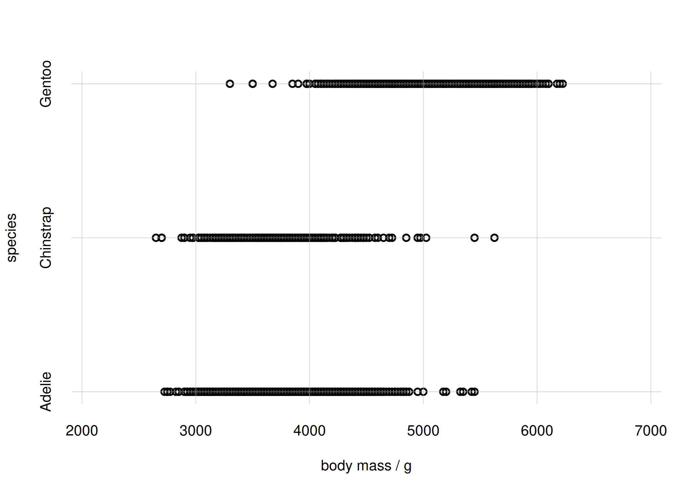
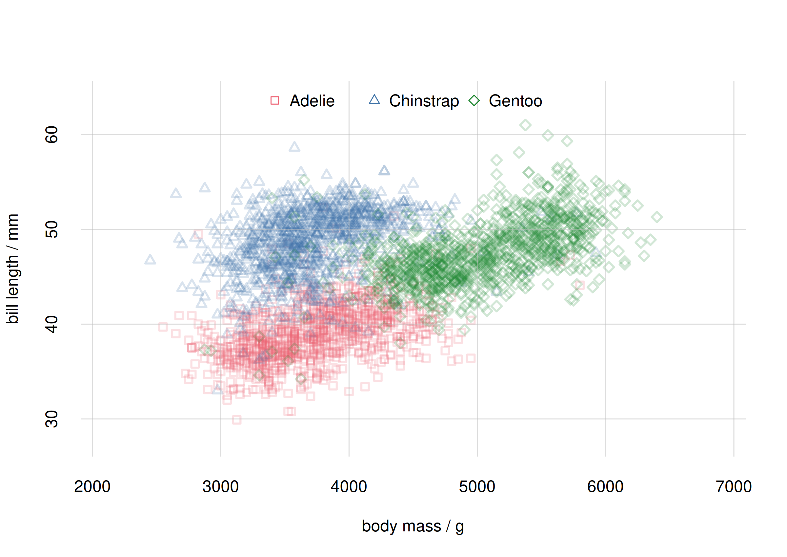

This vignette gives an introduction and guide to the visual and quantitative capabilities and functions of the ***inferno*** package, for the study of associations, correlations, and links.

See the `vignette('inferno_start')` for an introduction to the package. The present vignette continues with the same example and dataset.

\

# Probabilities and associations

The `vignette('inferno_start')` focuses on the `datasets::penguins` dataset, and shows how to calculate probabilities of single and joint variates from that dataset; also probabilities conditional on given variates. These probabilities refers to a *new unit*; for example:

- If we find that $\mathrm{Pr}(\text{species}\mathrel{\!=\!} \text{Adelie}) = 44\%$, then there's a 44% probability that the next penguin we sample (from the same population) is of the *Adélie* species.
- If we find that $\mathrm{Pr}(\text{species}\mathrel{\!=\!} \text{Gentoo} \,\vert\, \text{island} \mathrel{\!=\!} \text{Biscoe}) = 1\%$, then if we have a new penguin, and we know it is from Biscoe island, there's a 1% probability that it is of the *Gentoo* species.

And these probabilities can also be interpreted as "estimates" of the corresponding *whole-population* frequencies.

\
Joint probabilities and conditional probabilities already give a quantitative measure of the "association", "correlation", or "link" between several variates. They tell us for instance that it can be rare or very common to observe particular pairs of values together; or that it is rare or very common to observe values of some variates in cases where other variates have particular values. In the example above, it's rare to observe the value `'Gentoo'` of the variate `species` in penguins that have value `'Biscoe'` for the variate `island`. These associations are extremely important in fields like medicine, where we may want to diagnose or prognose a disease from possible symptoms, or we try to understand which clinical conditions are associated with the disease, possibly because of underlying biological reasons.

We shall now explore first some visual ways to examine associations with ***inferno***, and then some more precise quantitative ways, which also apply when visualization becomes impossible.

\

# Generating and plotting *new* samples

## Setup

Let's load the ***inferno*** package, if we haven't already done so, and set a random seed to ensure reproducibility:


``` r
library('inferno')

set.seed(10)
```

As in the `vignette('inferno_start')`, we work with a specific population of penguins, of which we have 344 sample data stored in the [`datasets::penguins`] dataset, included in R version 4.5.0 and above. For your convenience you can download the shuffled dataset as the CSV file [`penguin_data.csv`](https://github.com/pglpm/inferno/raw/main/development/downloads/penguin_data.csv), then load it with the `read.csvi()` function as follows:


We assume that we have already learned all predictive information from this dataset by means of the ***inferno*** function `learn()`. This information is stored in an object stored in the compressed file `learnt.rds` within the output directory that was specified in the `learn()` function. For your convenience the object produced by the computation above can be downloaded as the file [`learntall.rds`](https://github.com/pglpm/inferno/raw/main/development/downloads/learntall.rds). Once you have downloaded it in your working directory you can just invoke


``` r
learnt <- 'learntall.rds'
```
which produces an object `learnt` (just a character string, in this case) which shall be used in the following analysis.

## Generating new samples

Let's focus on the `island` and `species` variates. Each variate has three possible values; ***inferno***'s utility function `vrtgrid()` allows us to create a vector of all possible values of each variate, which are stored in the metadata of the `learnt` object:


``` r
islandvalues <- vrtgrid(vrt = 'island', learnt = learnt)
# [1] "Biscoe"    "Dream"     "Torgersen"

speciesvalues <- vrtgrid(vrt = 'species', learnt = learnt)
# [1] "Adelie"    "Chinstrap" "Gentoo"
```

The `flexiplot()` function allows us to display the `island` and `species` variates against each other, for all *sample* data, as a scatter plot:


``` r
flexiplot(x = penguin$island, y = penguin$species,
    type = 'p', xlab = 'island', ylab = 'species',
    xdomain = islandvalues, ydomain = speciesvalues)
```

<div class="figure">

<p class="caption">**Scatter plot of sample data**</p>
</div>

Note how `flexiplot()` automatically add a slight jitter (by means of `base::jitter()`) to the discrete variates, so that the points don't just overlap rendering the plot otherwise incomprehensible.

We immediately see some basic features of these variates in this sample. For example:

- the most common occurrence is the pair `island = 'Biscoe'` and `species = 'Gentoo'`;
- the pair `island = 'Torgersen'` and `species = 'Chinstrap'` does *not* occur at all.

These are only features of this specific data sample, however. Can we generalize them to the *whole* population? Intuitively it seems probable that the `'Biscoe'`-`'Gentoo'` pair can indeed be the commonest occurrence in the whole population as well. But we can't say for sure that the `'Torgersen'`-`'Chinstrap'` pair never occurs in the whole population: our sample included only 344 penguins, so what we can say is that this pair roughly occurs less frequently than once every 344 penguins. In fact, a calculation with the `Pr()` function shows that its probability is around 0.3%:


``` r
prob <- Pr(Y = data.frame(island = 'Torgersen', species = 'Chinstrap'),
    learnt = learnt)

signif(prob$values, digits = 2)
#                      X
# Y                      [,1]
#   Torgersen,Chinstrap 0.003
```

\
This example shows the limitations of using sample data for visualizing features of the *whole* population. How would a scatter plot analogous to the one above look like, for the *whole* population of for a much larger sample?

The ***inferno*** package offers the function `rPr()` to generate a data.frame of fictitious samples from the estimated frequencies of the whole population. These samples can be used for different purposes, for instance to produce a scatter plot. The main arguments of `rPr()` are:

- `n`: a positive integer, the number of samples to generate.
- `Ynames`: vector of variate names; samples are generates for these variates jointly.
- `X`: data frame of variate values to restrict the sampling to specific subpopulations.
- `learnt`: the object that points to the computation made with the `learn()` function.

Let's first generate 5 samples from the estimated whole population of penguins, as an example:


``` r
rPr(
    n = 5,
    Ynames = c('island', 'species'),
    learnt = learnt
)
#        island   species
# 644_1  Biscoe    Gentoo
# 996_1  Biscoe    Gentoo
# 1228_1 Biscoe    Adelie
# 2230_1  Dream Chinstrap
# 3083_1  Dream Chinstrap
```

The rows of the resulting data frame are named according to the Monte Carlo samples used from the `learnt` object; they can be useful for peculiar studies but we can completely ignore them in the present case.

Now let's generate 2000 samples, and then plot them in a scatter plot:


``` r
samples <- rPr(n = 2000, Ynames = c('island', 'species'), learnt = learnt)

flexiplot(x = samples$island, y = samples$species,
    type = 'p', xlab = 'island', ylab = 'species',
    xdomain = islandvalues, ydomain = speciesvalues)
```

<div class="figure">

<p class="caption">**Scatter plot for whole population**</p>
</div>

The scatter plot above correctly reflects the *estimated* features of the *whole* population.

## Example with a continuous and a discrete variate

The sampling and plotting from the previous example is easily extended to any other pair or variates, or even to pairs of sets of variates. Let us visualize for instance the joint probability of `body_mass` and `species` with another scatter plot.

We generate 2000 whole-population samples of the two variates with `rPr()`, and then scatter-plot them with `flexiplot()`. First we select an appropriate plot range for the continuous variate `body_mass` by means of ***inferno***'s utility function `vrtgrid()`: this function chooses an optimal value based on, and including, the range of data previously observed:


``` r
body_massrange <- range(vrtgrid(vrt = 'body_mass', learnt = learnt))

samples <- rPr(n = 2000, Ynames = c('body_mass', 'species'), learnt = learnt)

flexiplot(x = samples$body_mass, y = samples$species,
    type = 'p', xlab = 'body_mass / g', ylab = 'species',
    xlim = body_massrange, ydomain = speciesvalues)
```

<div class="figure">

<p class="caption">**Scatter plot for body mass and species**</p>
</div>

Note again how `flexiplot()` automatically add a jitter to the discrete variate `species`, but not to the continuous `body_mass`.

From the plot we see that there is an association between the Adélie and Chinstrap species and lighter body mass, around 3500 g; and between the Gentoo species and heavier body mass, around 5000 g. Incidentally, this reflects the probability plot at the end of the `vignette('inferno_start')`.

## Samples and plots for different subpopulations

In a completely analogous way we can visually assess the association of two continuous variates, such as body mass and bill length (`bill_len`):


``` r
bill_lenrange <- range(vrtgrid(vrt = 'bill_len', learnt = learnt))

samples <- rPr(n = 2000, Ynames = c('body_mass', 'bill_len'), learnt = learnt)

flexiplot(x = samples$body_mass, y = samples$bill_len,
    type = 'p', xlab = 'body_mass / g', ylab = 'bill_len / mm',
    xlim = body_massrange, ylim = bill_lenrange)
```

<div class="figure">

<p class="caption">**Scatter plot of body mass and bill length**</p>
</div>

The scatter plot shows that there is a partly linear relationship between body mass and bill length; but there's a sort of additional cluster around 4000 g for body mass and 45 mm for bill length.

This observation leads to another interesting question: is the association between `body_mass` and `bill_len` different for different species? Perhaps the additional cluster is characteristic of one species only. We are therefore interested in studying this association for different **subpopulations**.

Subpopulation sampling and plots can also be easily done with the `rPr()` and `flexiplot()` functions. In the `rPr()` function we can specify the requested subpopulation via the `X` argument, analogously to the `Pr()` function.

Let's generate sets of samples separately for the species `'Adelie'`, `'Chinstrap'`, `'Gentoo'`:


``` r
samplesAdelie <- rPr(
    n = 1000,
    Ynames = c('body_mass', 'bill_len'),
    X = data.frame(species = 'Adelie'),
    learnt = learnt)

samplesChinstrap <- rPr(
    n = 1000,
    Ynames = c('body_mass', 'bill_len'),
    X = data.frame(species = 'Chinstrap'),
    learnt = learnt)

samplesGentoo <- rPr(
    n = 1000,
    Ynames = c('body_mass', 'bill_len'),
    X = data.frame(species = 'Gentoo'),
    learnt = learnt)
```

Now we plot these samples together with `flexiplot()`, choosing different colours and shapes for the three subpopulations. We also use the `alpha.f` argument to make sure that the plot points don't completely cover one another:


``` r
flexiplot(
    x = cbind(samplesAdelie$body_mass,
        samplesChinstrap$body_mass,
        samplesGentoo$body_mass),
    y = cbind(samplesAdelie$bill_len,
        samplesChinstrap$bill_len,
        samplesGentoo$bill_len),
    type = 'p', xlab = 'body_mass / g', ylab = 'bill_len / mm',
    xlim = body_massrange, ylim = bill_lenrange,
    pch = c(0, 2, 5), col = 2:4, alpha.f = 0.2)

legend('top', speciesvalues, pch = c(0, 2, 5), col = 2:4,
    horiz = TRUE, bty = 'n')
```

<div class="figure">

<p class="caption">**Scatter plot for species subpopulations**</p>
</div>

The plot above shows quite clearly that the `body_mass`-`bill_len` association is indeed different for each species. The roughly linear relationship that we thought we saw earlier was partially spurious, coming from the combination of associations for Adélie and Gentoo penguins.

\

*(TO BE CONTINUED)*
