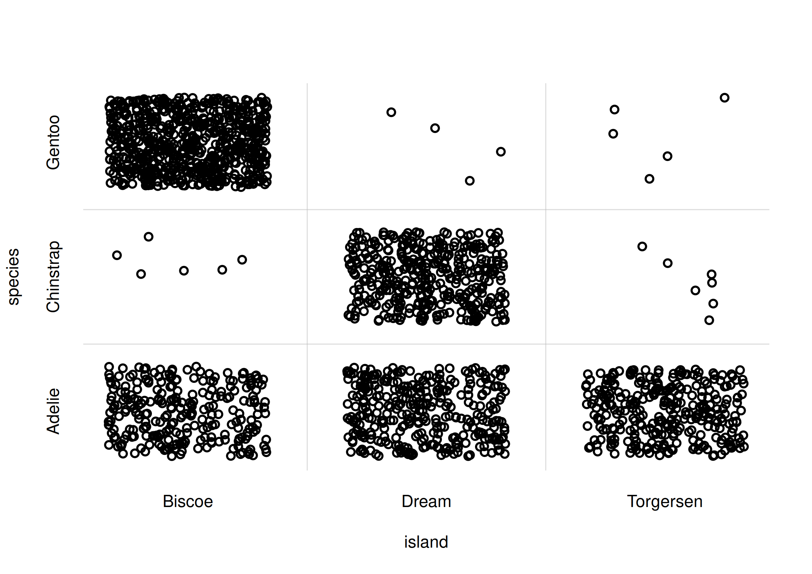
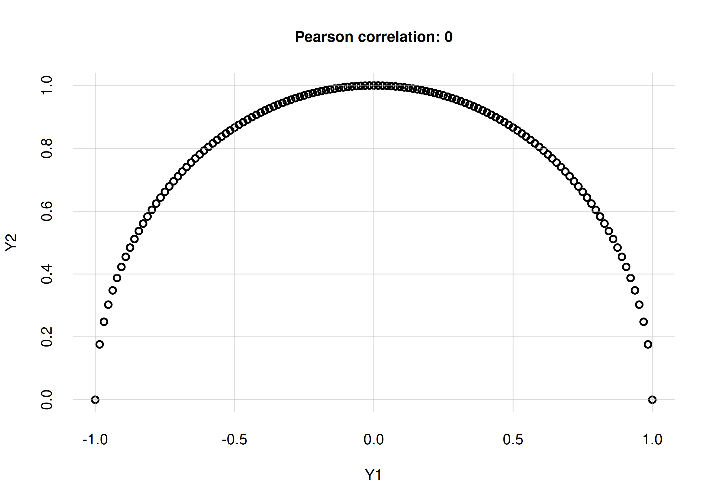
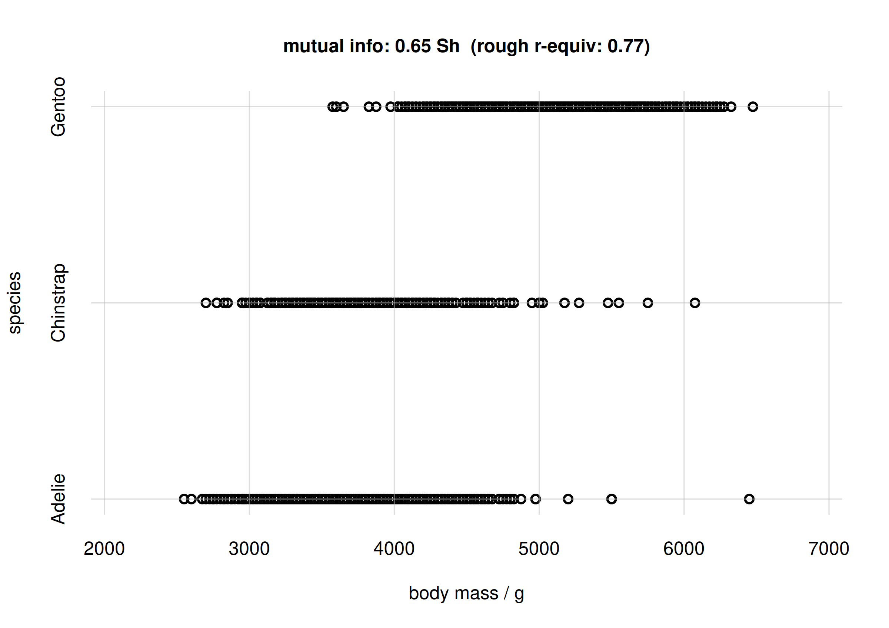
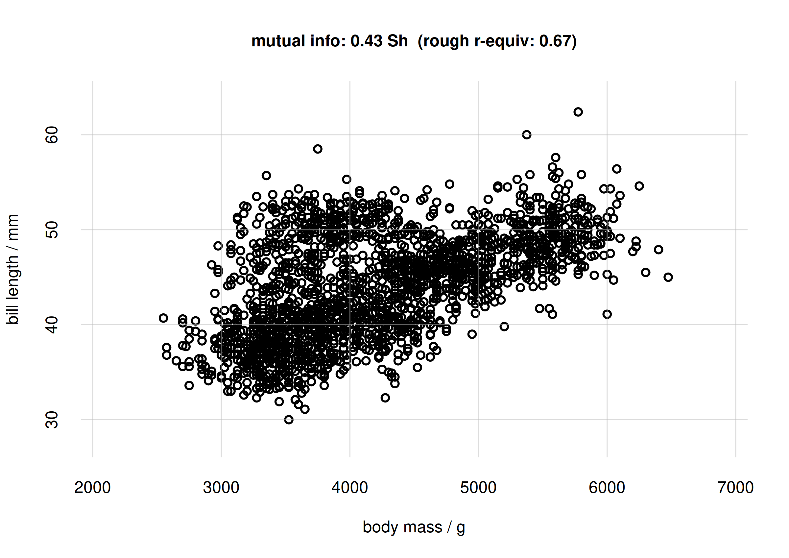
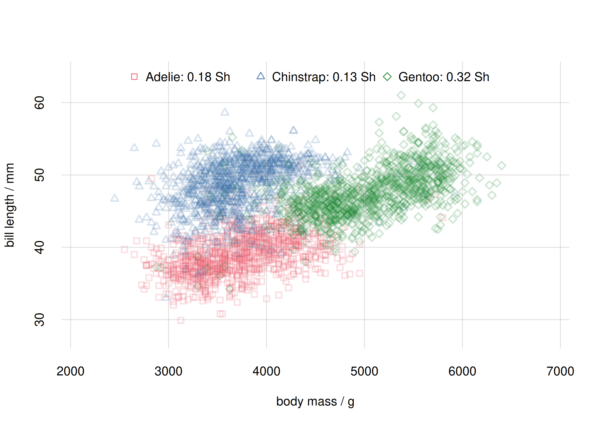

\newcommand{\mo}{\mathrel{\!=\!}}

This vignette gives an introduction and guide to the visual and quantitative capabilities and functions of the ***inferno*** package, for the study of associations, correlations, and links.

See the `vignette('inferno_start')` for an introduction to the package. The present vignette continues with the same example and dataset.

\

# Probabilities and associations

The `vignette('inferno_start')` focuses on the `datasets::penguins` dataset, and shows how to calculate probabilities of single and joint variates from that dataset; also probabilities conditional on given variates. These probabilities refers to a *new unit*; for example:

- If we find that $\mathrm{Pr}(\text{species}\mo \text{Adelie}) = 44\%$, then there's a 44% probability that the next penguin we sample (from the same population) is of the *Adélie* species.
- If we find that $\mathrm{Pr}(\text{species}\mo \text{Gentoo} \,\vert\, \text{island} \mo \text{Biscoe}) = 1\%$, then if we have a new penguin, and we know it is from Biscoe island, there's a 1% probability that it is of the *Gentoo* species.

And these probabilities can also be interpreted as "estimates" of the corresponding *whole-population* frequencies.

\
Joint probabilities and conditional probabilities already give a quantitative measure of the "association", "correlation", or "link" between several variates. They tell us for instance that it can be rare or very common to observe particular pairs of values together; or that it is rare or very common to observe values of some variates in cases where other variates have particular values. In the example above, it's rare to observe the value `'Gentoo'` of the variate `species` in penguins that have value `'Biscoe'` for the variate `island`. These associations are extremely important in fields like medicine, where we may want to diagnose or prognose a disease from possible symptoms, or we try to understand which clinical conditions are associated with the disease, possibly because of underlying biological reasons.

We shall now explore first some visual ways to examine associations with ***inferno***, and then some more precise quantitative ways, which also apply when visualization becomes impossible.

\

# Generating and plotting *new* samples

## Setup

Let's load the ***inferno*** package, if we haven't already done so, and set a random seed to ensure reproducibility:


``` r
library('inferno')

set.seed(10)
```

As in the `vignette('inferno_start')`, we work with a specific population of penguins, of which we have 344 sample data stored in the [`datasets::penguins`] dataset, included in R version 4.5.0 and above. For your convenience you can download the shuffled dataset as the CSV file [`penguin_data.csv`](https://github.com/pglpm/inferno/raw/main/development/downloads/penguin_data.csv), then load it with the `read.csvi()` function as follows:


We assume that we have already learned all predictive information from this dataset by means of the ***inferno*** function `learn()`. This information is stored in an object stored in the compressed file `learnt.rds` within the output directory that was specified in the `learn()` function. For your convenience the object produced by the computation above can be downloaded as the file [`learntall.rds`](https://github.com/pglpm/inferno/raw/main/development/downloads/learntall.rds). Once you have downloaded it in your working directory you can just invoke


``` r
learnt <- 'learntall.rds'
```
which produces an object `learnt` (just a character string, in this case) which shall be used in the following analysis.

## Generating new samples {#newsamples}

Let's focus on the `island` and `species` variates. Each variate has three possible values; ***inferno***'s utility function `vrtgrid()` allows us to create a vector of all possible values of each variate, which are stored in the metadata of the `learnt` object:


``` r
islandvalues <- vrtgrid(vrt = 'island', learnt = learnt)
# [1] "Biscoe"    "Dream"     "Torgersen"

speciesvalues <- vrtgrid(vrt = 'species', learnt = learnt)
# [1] "Adelie"    "Chinstrap" "Gentoo"
```

The `flexiplot()` function allows us to display the `island` and `species` variates against each other, for all *sample* data, as a scatter plot:


``` r
flexiplot(x = penguin$island, y = penguin$species,
    type = 'p', xlab = 'island', ylab = 'species',
    xdomain = islandvalues, ydomain = speciesvalues)
```

<div class="figure">

<p class="caption">**Scatter plot of sample data**</p>
</div>

Note how `flexiplot()` automatically add a slight jitter (by means of `base::jitter()`) to the discrete variates, so that the points don't just overlap rendering the plot otherwise incomprehensible.

We immediately see some basic features of these variates in this sample. For example:

- the most common occurrence is the pair `island = 'Biscoe'` and `species = 'Gentoo'`;
- the pair `island = 'Torgersen'` and `species = 'Chinstrap'` does *not* occur at all.

These are only features of this specific data sample, however. Can we generalize them to the *whole* population? Intuitively it seems probable that the `'Biscoe'`-`'Gentoo'` pair can indeed be the commonest occurrence in the whole population as well. But we can't say for sure that the `'Torgersen'`-`'Chinstrap'` pair never occurs in the whole population: our sample included only 344 penguins, so what we can say is that this pair roughly occurs less frequently than once every 344 penguins. In fact, a calculation with the `Pr()` function shows that its probability is around 0.3%:


``` r
prob <- Pr(Y = data.frame(island = 'Torgersen', species = 'Chinstrap'),
    learnt = learnt)

signif(prob$values, digits = 2)
#                      X
# Y                      [,1]
#   Torgersen,Chinstrap 0.003
```

\
This example shows the limitations of using sample data for visualizing features of the *whole* population. How would a scatter plot analogous to the one above look like, for the *whole* population of for a much larger sample?

The ***inferno*** package offers the function `rPr()` to generate a data.frame of fictitious samples from the estimated frequencies of the whole population. These samples can be used for different purposes, for instance to produce a scatter plot. The main arguments of `rPr()` are:

- `n`: a positive integer, the number of samples to generate.
- `Ynames`: vector of variate names; samples are generates for these variates jointly.
- `X`: data frame of variate values to restrict the sampling to specific subpopulations.
- `learnt`: the object that points to the computation made with the `learn()` function.

Let's first generate 5 samples from the estimated whole population of penguins, as an example:


``` r
rPr(
    n = 5,
    Ynames = c('island', 'species'),
    learnt = learnt
)
#        island   species
# 644_1  Biscoe    Gentoo
# 996_1  Biscoe    Gentoo
# 1228_1 Biscoe    Adelie
# 2230_1  Dream Chinstrap
# 3083_1  Dream Chinstrap
```

The rows of the resulting data frame are named according to the Monte Carlo samples used from the `learnt` object; they can be useful for peculiar studies but we can completely ignore them in the present case.

Now let's generate 2000 samples, and then plot them in a scatter plot:


``` r
samples <- rPr(n = 2000, Ynames = c('island', 'species'), learnt = learnt)

flexiplot(x = samples$island, y = samples$species,
    type = 'p', xlab = 'island', ylab = 'species',
    xdomain = islandvalues, ydomain = speciesvalues)
```

<div class="figure">

<p class="caption">**Scatter plot for *whole* population**</p>
</div>

The scatter plot above correctly reflects the *estimated* features of the *whole* population.

## Example with a continuous and a discrete variate

The sampling and plotting from the previous example is easily extended to any other pair or variates, or even to pairs of sets of variates. Let us visualize for instance the joint probability of `body_mass` and `species` with another scatter plot.

We generate 2000 whole-population samples of the two variates with `rPr()`, and then scatter-plot them with `flexiplot()`. First we select an appropriate plot range for the continuous variate `body_mass` by means of ***inferno***'s utility function `vrtgrid()`: this function chooses an optimal value based on, and including, the range of data previously observed:


``` r
body_massrange <- range(vrtgrid(vrt = 'body_mass', learnt = learnt))

samples <- rPr(n = 2000, Ynames = c('body_mass', 'species'), learnt = learnt)

flexiplot(x = samples$body_mass, y = samples$species,
    type = 'p', xlab = 'body mass / g', ylab = 'species',
    xlim = body_massrange, ydomain = speciesvalues)
```

<div class="figure">

<p class="caption">**Scatter plot for body mass and species**</p>
</div>

Note again how `flexiplot()` automatically add a jitter to the discrete variate `species`, but not to the continuous `body_mass`.

From the plot we see that there is an association between the Adélie and Chinstrap species and lighter body mass, around 3500 g; and between the Gentoo species and heavier body mass, around 5000 g. Incidentally, this reflects the probability plot at the end of the `vignette('inferno_start')`.

## Samples and plots for different subpopulations {#subpopplots}

In a completely analogous way we can visually assess the association of two continuous variates, such as body mass and bill length (`bill_len`):


``` r
bill_lenrange <- range(vrtgrid(vrt = 'bill_len', learnt = learnt))

samples <- rPr(n = 2000, Ynames = c('body_mass', 'bill_len'), learnt = learnt)

flexiplot(x = samples$body_mass, y = samples$bill_len,
    type = 'p', xlab = 'body mass / g', ylab = 'bill length / mm',
    xlim = body_massrange, ylim = bill_lenrange)
```

<div class="figure">

<p class="caption">**Scatter plot of body mass and bill length**</p>
</div>

The scatter plot shows that there is a partly linear relationship between body mass and bill length; but there's a sort of additional cluster around 4000 g for body mass and 45 mm for bill length.

This observation leads to another interesting question: is the association between `body_mass` and `bill_len` different for different species? Perhaps the additional cluster is characteristic of one species only. We are therefore interested in studying this association for different **subpopulations**.

Subpopulation sampling and plots can also be easily done with the `rPr()` and `flexiplot()` functions. In the `rPr()` function we can specify the requested subpopulation via the `X` argument, analogously to the `Pr()` function.

Let's generate sets of samples separately for the species `'Adelie'`, `'Chinstrap'`, `'Gentoo'`:


``` r
samplesAdelie <- rPr(
    n = 1000,
    Ynames = c('body_mass', 'bill_len'),
    X = data.frame(species = 'Adelie'),
    learnt = learnt)

samplesChinstrap <- rPr(
    n = 1000,
    Ynames = c('body_mass', 'bill_len'),
    X = data.frame(species = 'Chinstrap'),
    learnt = learnt)

samplesGentoo <- rPr(
    n = 1000,
    Ynames = c('body_mass', 'bill_len'),
    X = data.frame(species = 'Gentoo'),
    learnt = learnt)
```

Now we plot these samples together with `flexiplot()`, choosing different colours and shapes for the three subpopulations. We also use the `alpha.f` argument to make sure that the plot points don't completely cover one another:


``` r
flexiplot(
    x = cbind(samplesAdelie$body_mass,
        samplesChinstrap$body_mass,
        samplesGentoo$body_mass),
    y = cbind(samplesAdelie$bill_len,
        samplesChinstrap$bill_len,
        samplesGentoo$bill_len),
    type = 'p', xlab = 'body mass / g', ylab = 'bill length / mm',
    xlim = body_massrange, ylim = bill_lenrange,
    pch = c(0, 2, 5), col = 2:4, alpha.f = 0.2)

legend('top', speciesvalues, pch = c(0, 2, 5), col = 2:4,
    horiz = TRUE, bty = 'n')
```

<div class="figure">

<p class="caption">**Scatter plot for species subpopulations**</p>
</div>

The plot above shows quite clearly that the `body_mass`-`bill_len` association is indeed different for each species. The roughly linear relationship that we thought we saw earlier was partially spurious, coming from the combination of associations for Adélie and Gentoo penguins.

\

# Quantifying associations and correlations: mutual information

## Pearson correlation coefficient and its limitations

Plots like the ones above allow us to explore in a qualitative or semi-quantitative way the associations and correlations between two or three different variates and for different subpopulations. But we would like to *quantify* associations in a more precise way. And visualization may become impossible when we want to study the association between complex sets of joint variates.

One very common and quite abused measure of "association" is the [Pearson correlation coefficient](https://mathworld.wolfram.com/CorrelationCoefficient.html), usually denoted "$r$". This measure is extremely limited, however. It is essentially [based on the assumption that all variates involved have a joint Gaussian distribution](https://doi.org/10.1080/01621459.1954.10501231). As a consequence, it is a measure of *linear* association, rather than general association.

For instance, if the distribution of two continuous variates $Y_1$ and $Y_2$ lies in a semicircle, then $Y_2$ is actually a function of $Y_1$, and is therefore perfectly associated with $Y_1$: if we know $Y_1$, then we can exactly predict the value of $Y_2$. Yet the Pearson correlation coefficient between the two variates is $0$ in this case, simply because the functional dependence of $Y_2$ on $Y_1$ is not linear. Here is an example plot and value:


``` r
Y1 <- seq(-1, 1, length.out = 129) ## Y1 values
Y2 <- sqrt(1 - Y1^2) ## Y2 values: function of Y1

## Calculate Pearson correlation coefficient
r <- cor(Y1, Y2, method = 'pearson')
print(r)
# [1] 0

flexiplot(x = Y1, y = Y2, type = 'p',
    xlab = 'Y1', ylab = 'Y2',
    main = paste0('Pearson correlation: ', signif(r, 2)))
```

<div class="figure">

<p class="caption">**Perfect correlation from $Y_1$ to $Y_2$, with zero Pearson correlation coefficient**</p>
</div>

Similar limitations of the Pearson correlation coefficient are demonstrated by the "[Anscombe quartet](https://doi.org/10.2307/2682899)" of datasets.

The Pearson correlation coefficient, moreover, cannot be used in the case of nominal variates, because they cannot be sorted in any meaningful order. Yet there can be clear associations among nominal variates, as [was shown for the island and species variates](#newsamples).

## Mutual information

Is there a measure of association that enjoys at least the following three properties?:

- It quantifies general associations, not just linearity.
- It does not make any assumptions (such as Gaussianity) about the distribution of variates.
- It can be used for any kind of variates.

The answer is *yes, there is*! It is called the **mutual information** or [**mean transinformation content**](https://www.electropedia.org/iev/iev.nsf/display?openform&ievref=171-07-27) between variates $Y_1$ and $Y_2$. It has the following important properties:

- If there is no association whatever between $Y_1$ and $Y_2$, in the sense that knowledge of one never changes our probabilities about the other, then the mutual information between them is zero. Vice versa, if the mutual information is zero, then there is no association of any kind between $Y_1$ and $Y_2$.

- It can be defined for a pair of variates $Y_1$, $Y_2$ of any kind -- continuous, nominal, binary, images, audio signals, and so on.

- It is defined for any probability distribution $\mathrm{Pr}(Y_1, Y_2)$ for the two variates, without assumptions such as Gaussian shapes.

Mutual information is always positive or zero, and can be defined in several mathematically equivalent ways, such as the following:

$$
\sum_{y_1, y_2} \mathrm{Pr}(Y_1 \mo y_1, Y_2 \mo y_2) \, 
\log_{2} \frac{
\mathrm{Pr}(Y_1 \mo y_1, Y_2 \mo y_2)
}{
\mathrm{Pr}(Y_1 \mo y_1) \cdot \mathrm{Pr}(Y_2 \mo y_2)
} \; \mathrm{Sh}
$$

with integrals replacing the sums in the case of continuous variates. It is measured in [*shannons*](https://www.electropedia.org/iev/iev.nsf/display?openform&ievref=171-07-11) (symbol $\mathrm{Sh}$), or [*hartleys*](https://www.electropedia.org/iev/iev.nsf/display?openform&ievref=171-07-12) (symbol $\mathrm{Hart}$), or [*natural units*](https://www.electropedia.org/iev/iev.nsf/display?openform&ievref=171-07-13) (symbol $\mathrm{nat}$). These units and other properties of the mutual information are [standardized by the International Organization for Standardization (ISO) and the International Electrotechnical Commission (IEC)](https://archive.org/details/iso-standards-collection/BS%20EN%2080000-13-2008%20-%201%20Quantities%20and%20units).

Mutual information is in fact a core quantity of communication theory and information theory. The design and assessment of communication channels depends crucially on it. This makes sense: the main requisite of a communication channel is a strong association between two variates: its input and output messages. You can find a brilliant introduction to its meaning and uses in MacKay's book, see [references]{#references}.

\
The ***inferno*** package provides the function `mutualinfo()` to calculate the mutual information between two variates or two sets of joint variates. Its main arguments are the following:

- `Y1names`, `Y2names`: two vectors of variate names; the mutual information is calculated between these two sets.
- `X`: data frame of variate values to restrict the calculation to specific subpopulations.
- `learnt`: the object that points to the computation made with the `learn()` function.
- Optionally, `unit`: the mutual information unit; default "shannons" (Sh).
- Optionally, `parallel` specifies how many cores we should use for the computation.

Be aware that the computation can take even tens of minutes if the arguments `Y1names` and `Y2names` include multiple joint variates.

Let's calculate the mutual information between the variates `island` and `species`, [previously discussed and visualized](#newsamples):


``` r
MIislandspecies <- mutualinfo(
    Y1names = 'island', Y2names = 'species',
    learnt = learnt,
    parallel = 4 ## let's use 4 cores
)
# Registered doParallelSNOW with 4 workers
# 
# Closing connections to cores.
```


The resulting object `MIislandspecies` is a list of several quantities; the mutual information is given in the `$MI` element, which includes the accuracy of the result:


``` r
MIislandspecies$MI
#    value accuracy 
# 0.621682 0.016000
```

Between variates `island` and `species` there is thus a mutual information of 0.62 Sh. But what does this mean?

## Understanding mutual-information values

You might argue: "sure, this mutual information has all these wonderful properties, but what does its value actually mean? I know how to interpret a value of the Pearson correlation coefficient $r$".

It's important to be fair though. Remember the very first times you learned and used the Pearson correlation coefficient: were you able to give a meaning to "$r = 0.23" for example? was that value high or low? We learned how to interpret $r$ values only through repeated use and application to real situations. The same is true of mutual information: through repeated use and application, you'll develop an understanding of its possible values.

Mutual information does have an operational meaning. Saying that the mutual information between $X$ and $Y$ is $h\,\mathrm{Sh}$, means that knowledge of $X$ reduces, on average, $2^h$ times the number of uncertain possibilities of $Y$. For example suppose that a clinician during a diagnosis is equally uncertain about four possible diseases. There is a particular clinical indicator associated with the disease and the mutual information between the indicator and the disease is $0.415\,\mathrm{Sh}$. Then, upon testing the clinical indicator, the clinician will be roughly uncertain among *three* possible diseases, rather than four, because knowledge of the indicator reduces the four possibilities by $2^{0.415}$ ($4/(2^{0.415}) \approx 3$). If the mutual information were $2\,\mathrm{Sh}$ instead, then the indicator would tell the disease with *certainty*, as it would reduce the four possibilities by $2^{2}$ ($4/(2^{2}) = 1$).

But the function `mutualinfo()` has an additional output to help you get a rough understanding of the mutual-information value. In the special case of two continuous variates having a joint *Gaussian* distribution, there is a precise relationship between their mutual information $I$ and their Pearson correlation coefficient $r$:

$$
I = -\frac{1}{2} \log_{2}\bigl(1 - r^2\bigr)\;\mathrm{Sh} 
\,,\qquad
\lvert r\rvert = \sqrt{1 - 2^{- 2 I/\mathrm{Sh}}}
$$

<div class="figure">

<p class="caption">**$I$ vs $\lvert r\rvert$ for jointly Gaussian variates**</p>
</div>

This relationship can be a *rough* guide to get familiar with mutual-information values also for non-Gaussian variates. The `mutualinfo()` function has an additional output element `$MI.rGauss$` with the corresponding $\lvert r \rvert$ value. In the previous case of the `island` and `species` variates we have


``` r
MIislandspecies$MI
#    value accuracy 
# 0.621682 0.016000

MIislandspecies$MI.rGauss
#    value accuracy 
# 0.760009 0.008900
```

## Mutual information for previous examples

Let's re-display the scatter plots of the three pairs of variates explored previously, and calculate also their mutual information.

### Island and species


``` r
## mutual info, previously calculated
mi <- signif(MIislandspecies$MI['value'], digits = 2)

## approx r-equivalent
r <- signif(MIislandspecies$MI.rGauss['value'], digits = 2)

samples <- rPr(n = 2000, Ynames = c('island', 'species'), learnt = learnt)

flexiplot(x = samples$island, y = samples$species,
    type = 'p', xlab = 'island', ylab = 'species',
    xdomain = islandvalues, ydomain = speciesvalues,
    main = paste0('mutual info: ', mi, ' Sh',
        '  (rough r-equiv: ', r, ')') )
```

<div class="figure">

<p class="caption">**Scatter plot for `island` and `species`**</p>
</div>

### Body mass and species

Calculation of mutual info:


``` r
MIbodymassspecies <- mutualinfo(
    Y1names = 'body_mass', Y2names = 'species',
    learnt = learnt,
    parallel = 4
)
# Registered doParallelSNOW with 4 workers
# 
# Closing connections to cores.
```

Scatter plot:


``` r
## mutual info
mi <- signif(MIbodymassspecies$MI['value'], digits = 2)

## approx r-equivalent
r <- signif(MIbodymassspecies$MI.rGauss['value'], digits = 2)

samples <- rPr(n = 2000, Ynames = c('body_mass', 'species'), learnt = learnt)

flexiplot(x = samples$body_mass, y = samples$species,
    type = 'p', xlab = 'body mass / g', ylab = 'species',
    xlim = body_massrange, ydomain = speciesvalues,
    main = paste0('mutual info: ', mi, ' Sh',
        '  (rough r-equiv: ', r, ')') )
```

<div class="figure">

<p class="caption">**Scatter plot and mutual info for body mass and species**</p>
</div>

### Body mass and bill length

Calculation of mutual information:


``` r
MIbodymassbilllen <- mutualinfo(
    Y1names = 'body_mass', Y2names = 'bill_len',
    learnt = learnt,
    parallel = 4
)
# Registered doParallelSNOW with 4 workers
# 
# Closing connections to cores.
```

Scatter plot:


``` r
## mutual info
mi <- signif(MIbodymassbilllen$MI['value'], digits = 2)

## approx r-equivalent
r <- signif(MIbodymassbilllen$MI.rGauss['value'], digits = 2)

samples <- rPr(n = 2000, Ynames = c('body_mass', 'bill_len'), learnt = learnt)

flexiplot(x = samples$body_mass, y = samples$bill_len,
    type = 'p', xlab = 'body mass / g', ylab = 'bill length / mm',
    xlim = body_massrange, ylim = bill_lenrange,
    main = paste0('mutual info: ', mi, ' Sh',
        '  (rough r-equiv: ', r, ')') )
```

<div class="figure">

<p class="caption">**Scatter plot and mutual info for body mass and bill length**</p>
</div>

Note that in this case the Pearson correlation between `body_mass` and `bill_len` is


``` r
cor(samples$body_mass, samples$bill_len, method = 'pearson')
# [1] 0.562959
```

which is different from the rough $r$-equivalent 0.67.

\

## Mutual information within subgroups

We [previously discovered](#subpopplots) that the association between body mass and bill length is different for different penguin species. The `mutualinfo()` function allows us to calculate mutual information between two sets of variates within a particular subpopulation. This way we can determine whether two variates are more tightly associated within a particular subpopulation than within another. This kind of studies is important in medicine, where for instance a particular symptom may be a stronger indicator of a disease in a particular subgroup (e.g. females) than in another (e.g. males).

The subpopulation is chosen with the argument `X`, as in the `Pr()` and `rPr()` functions. Let's calculate the mutual information between `body_mass` and `bill_len` within each penguin species (please be aware that the whole computation could take half an hour):


``` r
MIadelie <- mutualinfo(
    Y1names = 'body_mass', Y2names = 'bill_len',
    X = data.frame(species = 'Adelie'), ## choose subpopulation
    learnt = learnt,
    parallel = 4
)

MIchinstrap <- mutualinfo(
    Y1names = 'body_mass', Y2names = 'bill_len',
    X = data.frame(species = 'Chinstrap'), ## choose subpopulation
    learnt = learnt,
    parallel = 4
)

MIgentoo <- mutualinfo(
    Y1names = 'body_mass', Y2names = 'bill_len',
    X = data.frame(species = 'Gentoo'), ## choose subpopulation
    learnt = learnt,
    parallel = 4
)
```

Let's compare the mutual information between `body_mass` and `bill_len` for each species, reporting the result together with the previous scatter plot:


``` r
## mutual info, joined
mispecies <- signif(c(
    MIadelie$MI['value'],
    MIchinstrap$MI['value'], 
    MIgentoo$MI['value']
), digits = 2)

flexiplot(
    x = cbind(samplesAdelie$body_mass,
        samplesChinstrap$body_mass,
        samplesGentoo$body_mass),
    y = cbind(samplesAdelie$bill_len,
        samplesChinstrap$bill_len,
        samplesGentoo$bill_len),
    type = 'p', xlab = 'body mass / g', ylab = 'bill length / mm',
    xlim = body_massrange, ylim = bill_lenrange,
    pch = c(0, 2, 5), col = 2:4, alpha.f = 0.2)

legend('top',
    paste(speciesvalues, paste0(mispecies, ' Sh'), sep = ': '),
    pch = c(0, 2, 5), col = 2:4,
    horiz = TRUE, bty = 'n')
```

<div class="figure">

<p class="caption">**Scatter plot and mutual info for species subpopulations**</p>
</div>

We see that body mass and bill length have a stronger association in the Gentoo species than in the Adélie or Chinstrap ones. In other words we can more precisely predict body mass from bill length, or vice versa, for Gentoo penguins than for the other two species.

It is interesting to contrast this result with values of the Pearson correlation coefficient:


``` r
## Pearson r for Adelie subpopulation:
cor(samplesAdelie$body_mass, samplesAdelie$bill_len, method = 'pearson')
# [1] 0.467353

## Pearson r for Chinstrap subpopulation:
cor(samplesChinstrap$body_mass, samplesChinstrap$bill_len, method = 'pearson')
# [1] 0.352141

## Pearson r for Gentoo subpopulation:
cor(samplesGentoo$body_mass, samplesGentoo$bill_len, method = 'pearson')
# [1] 0.479998
```

The Pearson correlation yields the same the association *ranking* as the mutual information does (first Gentoo, then Adélie, then Chinstrap), but it yields the association for the Adélie subpopulation to be closer to the Gentoo one than to the Chinstrap one. The mutual information yields the opposite.

\

*(TO BE CONTINUED)*

\

# Appendices {#appendix}

## References {#references}

- MacKay: [*Information Theory, Inference, and Learning Algorithms*](https://www.inference.org.uk/itila/book.html) (2005).
