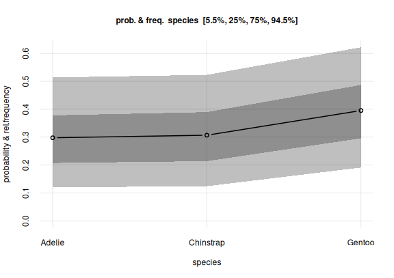

This vignette gives an introduction and guide to the kinds of *Bayesian nonparametric inference* that can be done with **Prova**, by means of a concrete example. It also has the purpose to clarify the terminology used in the **Prova** package.

\

# Before we start

It is of course impossible to summarize this branch of probability theory and of statistics in a couple of sections; you're invited to learn more for instance from the texts given in the [references](#references).

Two extremely important warnings before you follow the example:

- Some terms may sound familiar to you, but keep in mind that they may have quite different meanings from what you're used to. This is especially true of the terms in **boldface**. When you see a term in **boldface**, try to understand its meaning from the way it's used, rather than assuming the meaning familiar to you.  Different methods and different disciplines unfortunately use the same terms in different ways.

  In particular keep in mind that the term **probability** does *not* mean **frequency**. 'Probability' means 'plausibility', or 'credibility', or 'degree of belief': it is a quantification of our uncertainty about some possible fact. There is a connection between probability and frequency, but they are not the same. This distinction is important, because one of the main problems in statistical inference is that *we are uncertain about the frequency of something* -- the occurrence of a disease, of a symptom, or of other characteristics -- and our goal is to quantify and reduce that uncertainty as much as possible. The frequency of something in a population or group or collection is a static value, often unknown. Probability is something dynamic: it updates when new information becomes available.

- The example that follows is, like every example, very specific. But *try to see the more general, abstract picture behind it*, and to see how its general methodology could be applied to your own research. From time to time we shall draw analogies with other examples that may look very different and yet use essentially the same methodology.

\
You're now welcome to open R in your favourite integrated development environment, choose a directory to work in, and test the code that follows. Let's start by loading the **Prova** package:


``` r
library('prova')
```

In our example we shall use data from the `datasets::penguins` dataset, included in R version 4.5.0 and above. We shuffle this dataset to erase any particular ordering of its data, and call the new dataset `penguin` (without the final 's'):


``` r
set.seed(50) ## replace with your favourite seed number

penguin <- penguins[sample(1:nrow(penguins)), ] ## shuffle

pwrite.csv(penguin, file = 'penguin_data.csv')
```

The utility function `pwrite.csv()` saves the dataset as a CSV file that respects the [formatting rules required by **Prova**](#format). For your convenience you can also download the shuffled dataset as the CSV file [`penguin_data.csv`](https://github.com/pglpm/prova/raw/main/development/downloads/penguin_data.csv). We assume that you now have the `penguin_data.csv` file.

\

# Penguins

We are researchers interested in penguins; specifically the **population** living in the Antarctic islands *Biscoe*, *Dream*, *Torgersen*. Our research questions are not yet precisely defined, but some initial questions of interest are the following. The penguins can be of three species: [*Adélie*](https://www.bas.ac.uk/about/antarctica/wildlife/penguins/adelie-penguin/), [*Chinstrap*](https://www.bas.ac.uk/about/antarctica/wildlife/penguins/chinstrap-penguin/), [*Gentoo*](https://www.bas.ac.uk/about/antarctica/wildlife/penguins/gentoo-penguin/); we'd like to know:

Q1
: What's the overall statistical occurrence of the three species, independently of location or other details? In other words, what is the relative frequency of each species in the population?

Q2
: Do the three species differ, *statistically*, in some physical or geographical characteristic such as sex or island of origin? We say "statistically" because, for instance, there surely are females and males of every species, but it's possible that for one of the species the ratio of females to males is higher than for another species.

Q3
: Is there a physical or geographical characteristic that allows us to make a good guess about a penguin's species? We say "guess" because, for instance, from knowing which island a penguin comes from we can't be 100% sure about that penguin's species.

In order to approach these and other future questions, we decide which set of penguin characteristics we should consider and observe. These characteristics are called the **variates** of the population. This set can be extended or reduced later on. Guided by previous studies, or by some hypotheses we are entertaining, we choose the following variates, each denoted by a short `codeword`:

- Species (`species`)
- Island (`island`)
- Bill length (`bill_len`): [the length of a penguin's "beak"](https://allisonhorst.github.io/palmerpenguins/reference/figures/culmen_depth.png) in millimetres
- Bill depth (`bill_dep`): [the depth of a penguin's "beak"](https://allisonhorst.github.io/palmerpenguins/reference/figures/culmen_depth.png) in millimetres
- Flipper length (`flipper_len`): the length of a penguin's "wing" in millimetres
- Body mass (`body_mass`) in grams
- Sex (`sex`)
- Study year (`year`): the year a penguin was observed and measured

We include the last variate because there could be time trends in the values we observe. For instance, a particular species might have more females than males during one year, and vice versa during another year.


## "Population"?

The question of time-trends leads us to more general considerations and questions about statistical research, which unfortunately are often forgotten.

To start with: this "population" which we want to study, how is it defined exactly? What counts as a member of the population, and what doesn't? For example, a seal clearly doesn't count, because it isn't a penguin. A penguin from the Galápagos island doesn't count either, because it isn't from one of the three Antarctic islands we specified. But does a penguin who was alive in the year 1830 count? what about one who will live in those islands in the year 2100? Does a penguin with some kind of notable physical impairment count? Does a penguin who only lived 1 year count? Does a penguin born in the Galápagos island but subsequently transported to the Antarctic islands count?

No matter which research field you work in, you realize that analogous questions appear when you try to define the "population" in some study.

It is practically impossible to specify an exact criterion for membership in a population under study. We may try to cover and delimit as many factors as possible, but there may always appear a new one we didn't think of. There's no objective specification of a population: the specification depends on our research purpose, which is often not precisely specified either. We must therefore always be prepared to further specify the population of our study. In some cases we may even need to modify our previous specification, and thus discard some data or acquire new ones.

The intrinsic and unavoidable problem in the specification of a population has important consequences for the way we observe and measure the population and its variates. We now turn to this problem.

## Sampling

Our questions **Q1**, **Q2**, **Q3** could have *exact statistical answers* if we had a *complete census* of the penguin population; that is, if we went and "measured" the values of the variates in each and every penguin of the population.

To make this point clearer, imagine a slightly different population. Suppose we were interested only in all the penguins alive today on a specific, very small island. The island turns out to have 17 penguins. We check all of them. We find that 6 of these are females, and 11 are males. It's then a fact that $6/17 \approx 35.3\%$ of penguins in this specific population are females, and 64.7% are males. And if someone picked a penguin from this population and asked us to guess its sex, we would give a 35.3% probability to that penguin's being female, and 64.7% to its being male.^[Note the difference between *probability* and *frequency*. If an expert colleague tells us "I was able to take a quick look at that penguin, and it looks female to me, though I'm not completely sure", then our *probability* that this specific penguin is female would get higher than 50%. If we observe the penguin and see that it's female, our probability for female would become 100%.  Yet the *frequency* of females in the population is still 35.3%.]

But it is often impractical or impossible to take a complete census. Think of the case were the whole population includes members or variates that will only exist in the future. For this reason we proceed as follows: we observe a **sample** of the whole population, and from the study of this sample we try to infer the statistical properties of the whole population. Our inferences are perforce uncertain: we can't be fully sure about the exact statistical properties of the whole population. The essential point, however, is that our uncertainty is not just a dichotomous matter of "I don't know" versus "I know"; instead it comes in degrees and is dynamic:

- we can *quantify* our uncertainty;
- we can *reduce* our uncertainty, sometimes to the point where it becomes almost a certainty.

Some trusted colleagues thus go to the three islands, and examine samples of penguins there, sending the values they observe back to us. The way they do the sampling would require a deep analysis and discussion, but for the moment we put these aside.

How many samples should our colleagues collect? The short answer is: as many as they can. The more samples we have, the more certain our conclusions will be -- all kinds of conclusions: for instance those that may reveal the presence, as well as those that may reveal the absence, of important associations.

One important feature of Bayesian inference is that *we don't need to choose beforehand when to stop sampling*. We can monitor the results as more and more samples arrive, and stop as soon as the level of certainty about the results is satisfactory. This is possible because in Bayesian inference the *sample size affects only the uncertainty* we have of the ground truth -- association, effect, or other hypothesis -- but *it cannot affect the ground truth itself*. If the truth is that "there is no effect", then this truth will come to light with more and more certainty as we increase the sample size, and no amount of sampling will be able to change this truth.

\

# How to use the sample data

## A first, preliminary analysis

Imagine that, a while after the sampling begun, our colleagues start sending the collected sample data to us, a little batch at a time. For the moment we assume that the batches are chosen without any systematic order; in particular, their order is unrelated to the time of sampling. We make this assumption in order to avoid trends, which we'll discuss in another vignette.

We receive the first 10 samples from our sampling survey and store them in the file `penguin_data10.csv`, respecting the [formatting rules required by **Prova**](#format):


``` r
datafile <- 'penguin_data10.csv'
pwrite.csv(penguin[1:10, ], datafile) ## write the first 10 samples
```

Here they are:


|   |species   |island    | bill_len| bill_dep| flipper_len| body_mass|sex    | year|
|:--|:---------|:---------|--------:|--------:|-----------:|---------:|:------|----:|
|1  |Adelie    |Torgersen |     37.8|     17.1|         186|      3300|       | 2007|
|2  |Chinstrap |Dream     |     54.2|     20.8|         201|      4300|male   | 2008|
|3  |Adelie    |Dream     |     36.2|     17.3|         187|      3300|female | 2008|
|4  |Chinstrap |Dream     |     52.0|     19.0|         197|      4150|male   | 2007|
|5  |Gentoo    |Biscoe    |     45.3|     13.7|         210|      4300|female | 2008|
|6  |Gentoo    |Biscoe    |         |         |            |          |       | 2009|
|7  |Adelie    |Torgersen |     42.5|     20.7|         197|      4500|male   | 2007|
|8  |Gentoo    |Biscoe    |     48.5|     15.0|         219|      4850|female | 2009|
|9  |Chinstrap |Dream     |     46.5|     17.9|         192|      3500|female | 2007|
|10 |Gentoo    |Biscoe    |     46.9|     14.6|         222|      4875|female | 2009|


If you generated the `penguin` dataset yourself, then your first 10 samples may be different.

In the data above, samples #1 and #6 have one or more missing variates. But incomplete data are not a problem: inferences can still be performed from them, because Bayesian methods and **Prova** automatically perform *imputation* of missing data, and they do so in a principled way (via the marginalization rule of probability theory).

With these datapoints we start our Bayesian nonparametric analysis using **Prova**! 

There are now two preliminary steps, which we must usually follow to perform an analysis:

1. Determine and prepare the **metadata** about the variates of interest.
2. Perform the general inference about the whole population from the sampled data; we shall call this **learning** from the sample data.

## Metadata preparation

Metadata are "data about the data". They must be provided in a CSV file respecting the [formatting rules](#format), or as a `data.frame`, and consist of around eight pieces of information about the variates of our population:

Variate name (`name`)
: This is a character or string: name of a variate. Different variates should obviously have different names.


Variate type (`type`)
: **Prova** can handle three kinds of variates:
    
    - `nominal`: it can take on a finite number of discrete values, which do not have any natural ordering. Examples could be sex or geographical location.
    - `ordinal`: it can take on a finite number of discrete values, which do have a natural ordering. They can be qualitative or numeric. Examples could be the degree of satisfaction of a customer, or the severity of a disease, or a [Likert scale](https://www.britannica.com/topic/Likert-Scale).
    - `continuous`: it can in principle take on an infinite number of continuous values, although they can be discretized or rounded. Examples could be age or weight.
    
    Many other types of variates exist. For example images and audio are also types of variates; but **Prova** cannot handle these complex types. A simple type of variate that **Prova** cannot properly handle is the *cyclic* one, such as time of day. There are no clear-cut separations between different types of variates; thus it's sometimes difficult to assess the type.


Domain minimum and maximum (`domainmin`, `domainmax`)
: These are numbers, only defined for numeric-ordinal and continuous variates. These metadata are the minimum and maximum value a variate can take on in a given study. For example, in a study about health or employment of adults, a variate *age* might have a minimum of 18 years. In a more general study involving people of all ages, the minimum would be 0. In a health study where people of 90 years or more are pooled together, the maximum would be 90 years. A minimum could also be minus-infinity, and a maximum plus-infinity. Obviously the minimum should be lower than the maximum.
    
    Sometimes the minimum or maximum is not clear-cut. For instance, there is no theoretical maximum on a person's age, although we can consider an age of 300 impossible to reach today. In such cases the maximum or minimum can be taken to be plus or minus infinity.

Interval between values (`datastep`)
: This is a positive number, only defined for numeric-ordinal and continuous variates. It is the separation between consecutive values. For example, in a 1--5 Likert-scale variate, the interval is 1. For an *age* variate expressed in and rounded to years, the interval is 1. For a *length* variate expressed in centimetres and rounded to millimetres, the interval is 0.1.

Inclusion of inimum and maximum (`minincluded`, `maxincluded`)
: These are logical or `yes`/`no`, only defined for continuous variates. They tell whether the minimum and maximum of a continuous variate are themselves possible values or not. Often such extreme values have a special meaning, and this information is important with censored or pooled data. For example, a *length* continuous variate might be expressed in decimetres and reported without rounding, but all lengths above 1 dm might be pooled together into the value "1 dm or more"; in such case we must make sure to state that `maxincluded` is `TRUE` or `"yes"`.

Values (`V1`, `V2`, ...)
: These are characters or strings, only defined for nominal or non-numeric ordinal variates. They are the values that a nominal or ordinal variate can *in principle* take on in the population of interest. Note that they include not only the values observed in a sample, but also those that could be observed in the rest of the population. A nominal or ordinal variate must have at least two distinct values; it wouldn't make much sense to draw inferences about it otherwise. The metadata file can contain further empty **V...** columns.

### Why does **Prova** need metadata?

Because it performs *nonparametric* inference. In other words, it does not assume the frequency distribution of the variates in the whole population to have any specific class of shapes, such as a Gaussians; nor does it assume any functional relation at all, as instead is the case for, say, linear regression. Bayesian nonparametric population inference and **Prova** try to extrapolate the frequency distribution of the whole population from the sample data provided. We must therefore provide to **Prova** the same general information that we ourselves have about the variates, and about any artificial modifications performed on their values, such as rounding or pooling.

In order to prepare the metadata file we can use **Prova**'s `metadatatemplate()` helper function. This function reads the sample data and prepares a preliminary file containing heuristic *guesses* about the metadata. We must then check and correct this file. The function motivates its guesses and warns about especially uncertain ones. Here is the code to generate a `penguin_metadata.csv` file, and the output and warnings of the helper function:


``` r
metadatafile <- 'penguin_metadata.csv'

metadatatemplate(data = datafile, file = metadatafile)
# Analyzing 8 variates for 10 datapoints.
# 
# * "species" variate:
#   -  3 different  values detected:
#  "Adelie", "Chinstrap", "Gentoo" 
#   which do not seem to refer to an ordered scale.
#   Assuming variate to be NOMINAL.
# 
# * "island" variate:
#   -  3 different  values detected:
#  "Biscoe", "Dream", "Torgersen" 
#   which do not seem to refer to an ordered scale.
#   Assuming variate to be NOMINAL.
# 
# * "bill_len" variate:
#   - Numeric values between 36.2 and 54.2 
#   Assuming variate to be CONTINUOUS.
#   - Distance between datapoints is a multiple of 0.1 
#   Assuming variate to be ROUNDED.
#   - All values are positive
#   Assuming "domainmin" to be 0
# 
# * "bill_dep" variate:
#   - Numeric values between 13.7 and 20.8 
#   Assuming variate to be CONTINUOUS.
#   - Distance between datapoints is a multiple of 0.1 
#   Assuming variate to be ROUNDED.
#   - All values are positive
#   Assuming "domainmin" to be 0
# 
# * "flipper_len" variate:
#   - Only 8 different numeric values detected:
# from 186 to 222 in steps of 1 
#   Assuming variate to be ORDINAL.
# 
# * "body_mass" variate:
#   - Only 7 different numeric values detected:
# from 3300 to 4875 in steps of 25 
#   Assuming variate to be ORDINAL.
# 
# * "sex" variate:
#   -  2 different  values detected:
#  "female", "male" 
#   which do not seem to refer to an ordered scale.
#   Assuming variate to be NOMINAL.
# 
# * "year" variate:
#   - Only 3 different numeric values detected:
# from 2007 to 2009 in steps of 1 
#   Assuming variate to be ORDINAL.
# 
# =========
# WARNINGS - please make sure to check these variates in the metadata file:
# 
# * "year" variate appears to have been rounded
# and then transformed to logarithmic scale.
# This may lead to problems in the inference.
# Preferably, transform it back to non-logarithmic scale.
# =========
# 
# Saved proposal metadata file as "penguin_metadata.csv" 
```

The preliminary metadata file created by `metadatatemplate()` looks like this:


|name        |type       | domainmin| domainmax| datastep| minincluded| maxincluded|V1     |V2        |V3        | V4| V5| V6| V7| V8| V9| V10| V11|
|:-----------|:----------|---------:|---------:|--------:|-----------:|-----------:|:------|:---------|:---------|--:|--:|--:|--:|--:|--:|---:|---:|
|species     |nominal    |          |          |         |            |            |Adelie |Chinstrap |Gentoo    |   |   |   |   |   |   |    |    |
|island      |nominal    |          |          |         |            |            |Biscoe |Dream     |Torgersen |   |   |   |   |   |   |    |    |
|bill_len    |continuous |         0|          |      0.1|            |            |       |          |          |   |   |   |   |   |   |    |    |
|bill_dep    |continuous |         0|          |      0.1|            |            |       |          |          |   |   |   |   |   |   |    |    |
|flipper_len |ordinal    |       186|       222|      1.0|            |            |       |          |          |   |   |   |   |   |   |    |    |
|body_mass   |ordinal    |      3300|      4875|     25.0|            |            |       |          |          |   |   |   |   |   |   |    |    |
|sex         |nominal    |          |          |         |            |            |female |male      |          |   |   |   |   |   |   |    |    |
|year        |ordinal    |      2007|      2009|      1.0|            |            |       |          |          |   |   |   |   |   |   |    |    |


If you generated the `penguin` dataset yourself, then you might obtain different guesses. Try to follow the following guidelines for the present example.

We see that `metadatatemplate()` guessed correctly about the `species`, `island`, `sex` variates: they are of `'nominal'` type, and all their possible values are correctly listed. If any of the possible values are missing from the sample, and therefore missing in the preliminary metadata, then we should add them under the  additional **V...** columns. We can sort the nominal values in any order we please.

Also the `bill_len` and `bill_dep` variates are correct: they are continuous, rounded to the nearest tenth of millimetre, and cannot be less than zero. The absence of **domainmax** values means that the theoretical maximum is plus infinity. We could replace this maximum with something more realistic, for instance `1000` mm or less, but typically this kind of changes do not lead to relevant differences in our inferences. The absence of **minincluded** means that the minimum, `0`, is not a possible value; similarly for **maxincluded**.

The `year` variate is correctly classified as ordinal, with values between 2007 and 2009. If the sampling had a later end date, we would correct the 2009 value. The `year` variate could alternatively be considered continuous and rounded; in the present case this alternative classification wouldn't affect our inferences: **Prova** treats this kind of ambiguous cases in the same way.

Also the `sex` variate is correctly guessed: `nominal` type with possible values `'female'` and `'male'`.

\
The guesses about the `flipper_len` and `body_mass` variates are not correct, however: these variates are continuous, with a minimal value of `0` and no maximal value. They are rounded to `1` mm and `25` g (this was correctly guessed).

We must open the preliminary metadata file `penguin_metadata.csv` with our favourite editor, and correct and complete the guesses of the helper function. In this case we end up with the following corrected metadata file, also available for download as [`penguin_metadata.csv`](https://github.com/pglpm/prova/raw/main/development/downloads/penguin_metadata.csv):


|name        |type       | domainmin| domainmax| datastep| minincluded| maxincluded|V1     |V2        |V3        |
|:-----------|:----------|---------:|---------:|--------:|-----------:|-----------:|:------|:---------|:---------|
|species     |nominal    |          |          |         |            |            |Adelie |Chinstrap |Gentoo    |
|island      |nominal    |          |          |         |            |            |Biscoe |Dream     |Torgersen |
|bill_len    |continuous |         0|          |      0.1|            |            |       |          |          |
|bill_dep    |continuous |         0|          |      0.1|            |            |       |          |          |
|flipper_len |continuous |         0|          |      1.0|            |            |       |          |          |
|body_mass   |continuous |         0|          |     25.0|            |            |       |          |          |
|sex         |nominal    |          |          |         |            |            |female |male      |          |
|year        |ordinal    |      2007|      2009|      1.0|            |            |       |          |          |


## "Learning" and extrapolating from the sample data {#learningfirst}

Now comes the essential part of our analysis: from the sample data and the metadata information,**Prova** will draw inferences about the *whole* population of penguins, including new penguins (from the same population) that we shall observe in the future. Subsequent analyses are based on this main inference. The general theory behind this kind of inference, based on the property of *exchangeability* and related mathematical theorems, is explained in the [references](#references).

This inference is performed by calling the `learn()` function. Its minimal arguments are three: the sample `data`, the `metadata`, and the name `outputdir` of a directory where the inference results should be saved; some additional information will be suffixed to this directory name. We can give a `parallel` argument specifying the number of cores to be used for parallel computation. A `seed` argument can also be given if we want to reproduce the same output in another run; or alternatively we can first call `set.seed()` in the usual R-way, as we did at the beginning of this vignette. (The function `learn()` in any case always saves the current random-seed status in its output directory, in the file `rng_seed.rds`, so it's always possible to recover its initial state.)

This function in fact does Monte Carlo sampling and is computationally expensive. It may take minutes, hours, or days to run, depending on the amount of sample data and the number of variates. In order to speed up its computations, it tries to use any multi-cores capabilities of the machine it runs in, or the number of cores specified in the `parallel` argument (which shouldn't be larger than the number of cores you actually have!).

The output below was obtained from running `learn()` on 4 cores -- *please wait before running this code*, it might take longer time on your computer:


``` r
## set.seed() already called

learnt10 <- learn(
    data = datafile,
    metadata = metadatafile,
    outputdir = 'penguin_inference',
    parallel = 4 ## how many cores to use for the computation
)
# Registered socket cluster with 4 nodes on host ‘localhost’.
# Calculating auxiliary metadata
# 
# Learning:  10 datapoints,  8 variates
# 
#  ************************************************** 
#  Saving output in directory
#  penguin_inference-261231T135959-vrt8_dat10_smp3600 
#  ************************************************** 
# Starting Monte Carlo sampling of 3600 samples by 8 chains
# in a space of 1023 (effectively 3856) dimensions.
# Using 4 cores: 450 samples per chain, max 2 chains per core.
# Requested:   ESS 450   rel.MCSE 0.047 
# Core logs are being saved in individual files.
# 
# C-compiling samplers appropriate to the variates (package Nimble)
# this can take tens of minutes. Please wait...
# Compiled core 1. Number of samplers: 1078.             
# Estimating remaining time, please be patient...
# Core 2 finished.                                        
# Core 4 finished.                                        
# Core 3 finished.                                        
# Core 1 finished.                                        
# Finished Monte Carlo sampling.                                 
# Highest number of Monte Carlo iterations across chains: 115200 
# Highest number of used mixture components: 5 
# 
# Checking test data
# ( #1 #2 #3 #4 #5 #6 #7 #8 #9 #10 )
# 
# 
# rel. CI error: 0.0331 to 0.265
# ESS: 3110 to 3880
# needed thinning: 3.93 to 252
# average: 2.69e-08 to 0.186
# width: 3.92e-08 to 0.322
# Plotting final Monte Carlo traces and marginal samples...
# 
# Total computation time: 9.8 mins 
# Average preparation & finalization time: 1.1 mins 
# Average Monte Carlo time per chain: 4.1 mins 
# Max total memory used: approx 3100 MB
# Max memory used per core: approx 790 MB
# 
# Removing temporary output files.
# Finished.
# Closing connections to cores.
```

The initial output gives a summary of the sample size, number of variates, saving directory, and other computational details. An "`estimated end time`" line (not appearing in the output above) is updated from time to time with a better estimate of the computation's end time. Once the computation is finished, some final information about the underlying Monte Carlo computation and time and memory use is provided.^[The Monte Carlo expert will notice that the effective sample size is around 900 or more. The Monte Carlo sampling is designed to stop when 3600 samples have been obtained with an effective sample size of at least 450, or equivalently a relative Monte Carlo standard error under 0.05. This is enough, considering that the statistical uncertainty in the results can be tens or hundreds of times larger than this. The desired number of samples and maximal Monte Carlo standard error can be specified with the `nsamples` and `maxrelMCSE` arguments.] The inference above, with 10 sample data and 8 variates, took around 3 GB and 10 minutes to complete on 4 cores.

The results of this main inference are now stored in the compressed file `learnt.rds` (around 32 MB) within the specified output directory. The name of this directory is also saved as the final value of the `learn()` function. We saved this directory name in the `learnt10` variable in the code above, by invoking `learnt10 <- learn(...)`.

For your convenience the object produced by the computation above can be downloaded as the file [`learnt10.rds`](https://github.com/pglpm/prova/raw/main/development/downloads/learnt10.rds). Once you have downloaded it in your working directory you can just invoke


``` r
learnt10 <- 'learnt10.rds'
```
which produces an object `learnt10` (just a character string, in this case) which can be used in the following analysis.

\

# Analysis example: frequencies of species {#prelimQ1}

## Estimating relative frequencies

Consider our first research question **Q1**: what's the overall statistical occurrence of the three species in the whole population? The relative frequencies of the three species in the whole population are unknown to us, so we cannot give a simple answer such as, hypothetically, "Adélie: 0.10, Chinstrap: 0.34, Gentoo: 0.56".

Bayesian nonparametrics and **Prova** give a first answer to this question in the form of:

- an *estimate* of the whole-population frequency distribution,
- the *uncertainty* of this estimate.

We discuss both in a moment. First let's compute them using the `Pr()` function. For the present question, this function requires three arguments:

- `Y`: a `data.frame` listing the values of the variate we are interested in. In the present case the variate is `species` and the values are 'Adelie', 'Chinstrap', 'Gentoo'.
- `learnt`: the object that points to the computation made with the `learn()` function, discussed in the previous section. In the present case it's `learnt10`.
- Optionally, `parallel` specifies how many cores we should use for the computation.

Here is a way to call the function; the computation should take at most a couple of seconds:


``` r
## data frame with the variate and values we want to know the frequencies of
Y <- data.frame(species = c('Adelie', 'Chinstrap', 'Gentoo'))

Fspecies10 <- Pr(
    Y = Y,
    learnt = learnt10,
    parallel = 4 ## let's use 4 cores
)
```

The answer to our question is now contained in the `Fspecies10` object (we chose this name for "`F`requency distribution of `species`, estimated from `10` samples"). The estimate and its uncertainty can be immediately visualized by calling `plot()` with this object:


``` r
plot(Fspecies10)
```

<div class="figure">

<p class="caption">**Estimates and uncertainty of relative frequencies of penguin species**</p>
</div>
\

The x-axis of this plot shows the three possible values of the `species` variate. The y-axis reports fractions which may be read as *frequencies* or *probabilities*.

The estimated frequency distribution for the species is the central, solid red curve with small circles. (You may be used to frequency distributions as histograms, rather than as a broken line like in the plot above. The present visualization is more advantageous when we want to compare several frequency distributions, as we'll do later.)

The three estimated frequencies are:

- Adélie: 0.30
- Chinstrap: 0.31
- Gentoo: 0.40

and can be read from the `values` element of the `Fspecies10` object:


``` r
Fspecies10$values
#            NA
# species         [,1]
#   Adelie    0.297758
#   Chinstrap 0.306937
#   Gentoo    0.395305
```

These frequency estimates have also another important meaning: they are the *probabilities for the species of the **next** penguin we'll observe*. More generally, they are the probabilities for the next observation. In the present context they are maybe not so relevant -- unless you're placing bets on which data will arrive next with your colleagues -- but in other inference contexts they may be very important. In a clinical setting, for example, where we try to infer some condition about the next patient, these probabilities are used for clinical decision-making; see the textbooks by Sox & al. and by Hunink & al., and the paper by Lindley & Novick in the [references]{#referencesmedical}.

For the moment we focus on the "frequency estimate" meaning.

What about the uncertainty of these estimates?

## Uncertainty of estimates: credibility intervals and probabilities

In Bayesian theory, a compact way of expressing the uncertainty in a quantity is by means of a **credibility interval** with a given probability. For instance, if we say that a particular quantity has a 70%-credibility interval equal to $(0.41, 0.69)$, what we mean is that there's an 70% probability that the true value of that quantity is between $0.41$ and $0.69$ -- pretty straightforward! *Please be careful not to confuse the Bayesian credibility interval with a "confidence interval"*: the latter has a much more involved and less straightforward meaning.

The `Pr()` function by default calculates two credibility intervals for each frequency estimate: a 50% one, and an 89% one. In our present inference, the 50%-credibility intervals are shown in the plot above as the darker grey band, and the 89%-credibility intervals as the lighter grey band. These intervals contain the 50% ones.

For instance, the plot indicates that there's a 50% probability that the relative frequency of all `Adelie` penguins is roughly between 0.21 and 0.38; and an 89% probability that their relative frequency is roughly between 0.12 and 0.51.

For the `Gentoo` species, there's a 50% probability that its relative frequency is roughly between 0.30 and 0.49; and an 89% probability that their relative frequency is roughly between 0.19 and 0.62.

We can Actually do more: we can plot the probabilities of all possible frequencies. To understand this idea, let's ask: what is the relative frequency of Adélie penguins in the whole population? Possible values could be anything between 0 and 1. But some of these values may be more probable than others. If we look at our 10 samples, we see that 3 out of 10 are `Adelie`. So a relative frequency around 0.3 is a little more probable, although there's still a lot of uncertainty because this is just a small sample.

The `Pr()` function has actually calculated the probabilities for all possible frequencies of each species. We can plot the probabilities of the frequencies of the `Adelie` species as follows:


``` r
## select only Adelie
onlyAdelie <- subset(Fspecies10, list(species = 'Adelie'))
# Error in `subset.default()`:
# ! 'subset' must be logical

hist(onlyAdelie, xlim = c(0, 1), legend = 'topright', col = 2)
# Error:
# ! object 'onlyAdelie' not found
```


