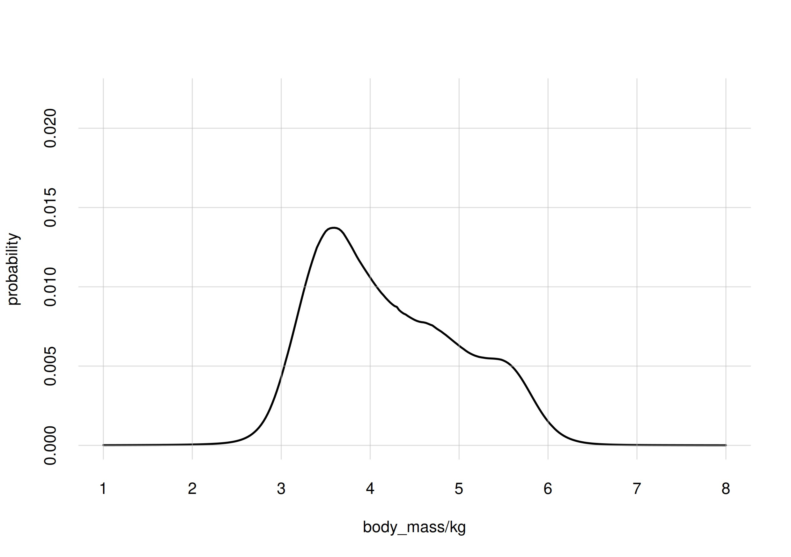
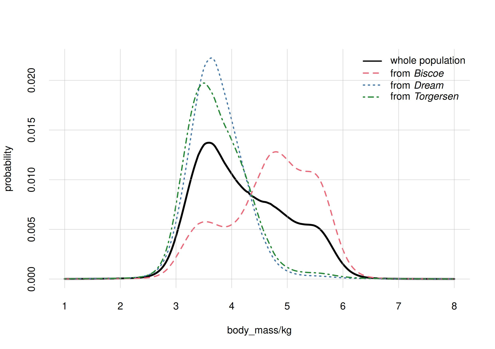
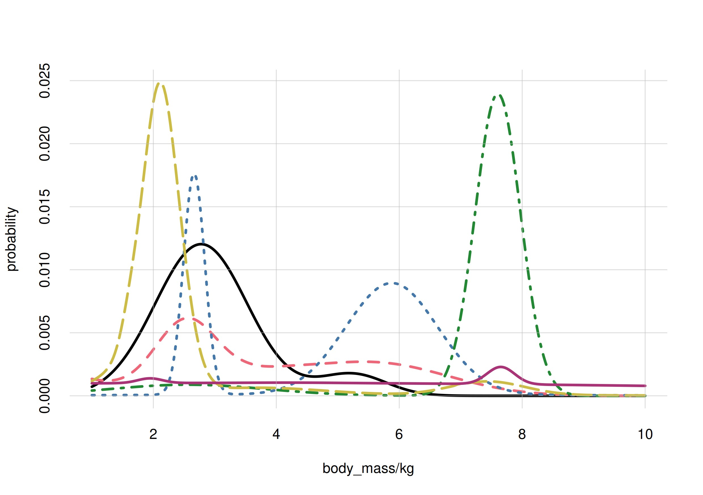
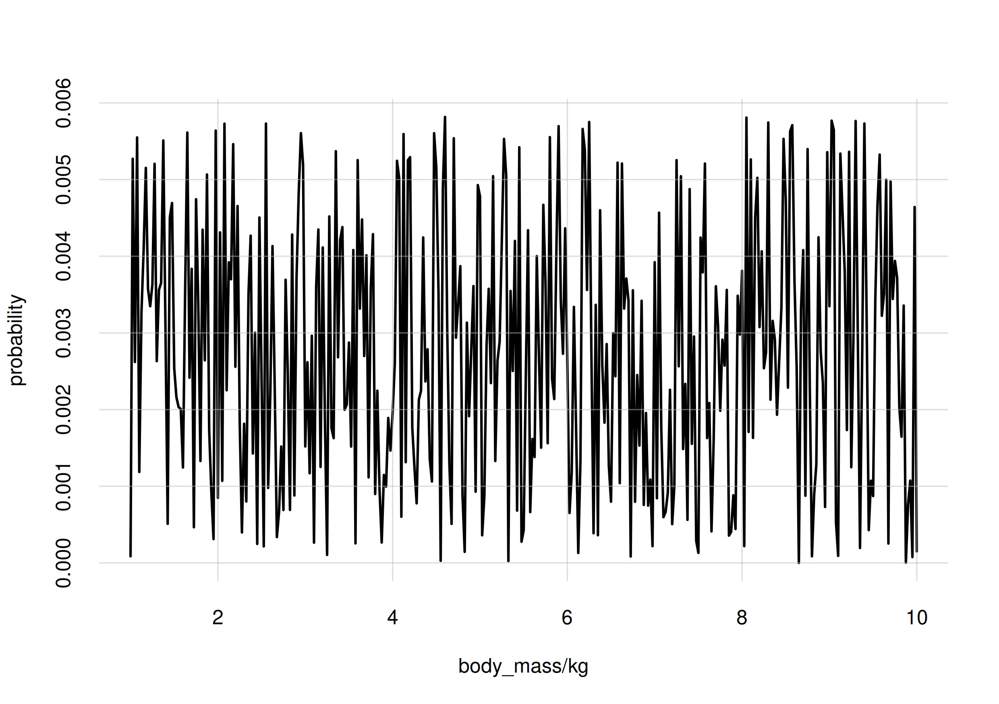
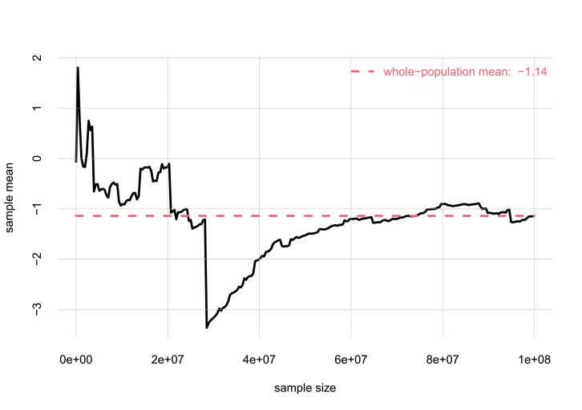

```{r, setup, include = FALSE}
knitr::opts_chunk$set(
    dev='png',
    fig.asp = 1/sqrt(2),
    fig.width = 8,
    out.width='100%',
    collapse = TRUE,
    comment = "#>"
)
options(knitr.kable.NA = '')
library(inferno)
## Tol colour-blind-friendly palette
palette(c(black='black',
        red='#EE6677',
        blue='#4477AA',
        green='#228833',
        yellow='#CCBB44',
        purple='#AA3377',
        cyan='#66CCEE',
        grey='#BBBBBB',
        midgrey='#888888'))
set.seed(16)
```

## Before we start

This vignette gives an introduction and guide to the kinds of *Bayesian nonparametric inference* that can be done with ***Inferno***, by means of a concrete example. It also has the purpose to clarify, by means of examples, the terminology used in the ***Inferno*** package.

It is of course impossible to summarize this branch of probability theory and of statistics in a couple of sections; you're invited to learn more for instance from the [ADA 511](https://pglpm.github.io/ADA511) course, or from texts such as Bernardo & Smith's [*Bayesian Theory* (2000)](https://doi.org/10.1002/9780470316870) (especially §§ 4.3, 4.4, 4.6), or Jaynes's [*Probability Theory* (2003)](https://doi.org/10.1017/CBO9780511790423) (esp. ch. 9); take also a look at Lindley & Novick [*The role of exchangeability in inference* (1981)](https://doi.org/10.1214/aos/1176345331).

Two extremely important warnings before you follow the example:

- Some terms may sound familiar to you, but keep in mind that they may have quite different meanings from what you're used to. This is especially true of the terms in *italics*. When you see a term in **boldface**, try to understand its meaning from the way it's used, rather than assuming the meaning familiar to you. Unfortunately, different methods and different disciplines use the same terms in different ways.
  
  In particular keep in mind that the term **probability** does *not* mean **frequency**. 'Probability' means 'plausibility' or 'degree of belief'; it is a quantification of a researcher's uncertainty about some possible fact. There is a connection between probability and frequency, but they are not the same. The distinction is important, because one of the main problems in statistical inference is that *we are uncertain about the frequency of something* -- the occurrence of a disease, symptom, or other characteristics -- and our goal is to quantify and reduce that uncertainty as much as possible.

- The example that follows is, like every example, very specific. But try to see the more general, abstract picture behind it, and to see how its general methodology could be applied to research that is more interesting to you. From time to time we shall draw analogies with other examples that may look very different and yet use essentially the same methodology.

## Penguins

We are researchers interested in penguins; specifically the **population** living in the Antarctic islands *Biscoe*, *Dream*, *Torgersen*. Our research questions are not yet precisely defined, but some initial questions of interest are the following. The penguins can be of three species: *Adelie*, *Chinstrap*, *Gentoo*; we'd like to know:

Q1
: Do the three species differ, *statistically*, in some physical or geographical characteristic such as sex or island of origin? We say "statistically" because, for instance, there surely are females and males of every species, but it's possible that for one of the species the ratio of females to males is higher than for another species.

Q2
: Is there a physical or geographical characteristic that allows us to make a good guess about a penguin's species? We say "guess" because, for instance, from knowing which island a penguin comes from we can't be 100% sure about that penguin's species.

In order to approach these and other future questions, we decide which set of penguin characteristics we should consider and observe. These characteristics are called the **variates** of the population. This set can be extended or reduced later on. Guided by previous studies, or by some hypotheses we are entertaining, we choose the following variates, each denoted by a short `codeword`:

- Species (`species`)
- Island (`island`)
- Bill (`bill_len`): [the length of a penguin's "beak"](https://allisonhorst.github.io/palmerpenguins/reference/figures/culmen_depth.png)
- Bill depth (`bill_dep`): [the depth of a penguin's "beak"](https://allisonhorst.github.io/palmerpenguins/reference/figures/culmen_depth.png)
- Flipper length (`flipper_len`): the length of a penguin's "wing"
- Body mass (`body_mass`)
- Sex (`sex`)

Later on we shall include an additional variate:

- Year (`year`): the year a penguin was observed and measured

because there could be time trends in the values we observe. For instance, a particular species might have more females than males during one year, and vice versa during another year.

#### "Population"?

The question of time-trends leads us to more general considerations and questions about statistical research, which unfortunately are often forgotten.

To start with: this "population" which we want to study, how is it defined exactly? What counts as a member of the population, and what doesn't? For example, a seal clearly doesn't count, because it isn't a penguin. A penguin from the Galápagos island doesn't count either, because it isn't from one of the three Antarctic islands we specified. But does a penguin who was alive in the year 1830 count? what about one who will live in those islands in the year 2100? Does a penguin with some kind of notable physical impairment count? Does a penguin who only lived 1 year count? Does a penguin born in the Galápagos island but subsequently transported to the Antarctic islands count?

No matter which research field you work in, you realize that analogous questions appear when you try to define the "population" in some study.

It is practically impossible to specify an exact criterion for membership in a population under study. We may try to cover and delimit as many factors as possible, but there may always appear a new one we didn't think of. There's no "objective" specification of a population: the specification depends on our research purpose -- which often is not precisely specified either. We must therefore always be prepared to further specify the population of our study. In some cases we may even need to modify our previous specification, and thus discard some data or acquire new ones.

The intrinsic and unavoidable problem in the specification of a population has important consequences for the way we observe and measure the population and its variates. We now turn to this problem.

#### Sampling

Our questions **Q1** and **Q2** could have *exact statistical answers* if we had a *complete census* of the penguin population; that is, if we went and "measured" the values of the variates in each and every penguin of the population.

To make this point clearer, imagine a slightly different population. Suppose we were interested only in all the penguins alive today on a specific, very small island. The island turns out to have 17 penguins. We check all of them. We find that 6 of these are females, and 11 are males. It's then a fact that 6/17${}\approx{}$35.3% of penguins in this specific population are females, and 64.7% are males. And if someone picked a penguin from this population and asked us to guess its sex, we would give a 35.3% probability to that penguin's being female, and 64.7% to its being male.^[Note the difference between probability and frequency. If an expert colleague tells us "I was able to take a quick look at that penguin, and it looks female to me, though I'm not completely sure", then our *probability* that this specific penguin is female would get higher than 50%. If we observe the penguin and see that it's female, our probability for female would become 100%.  Yet the *frequency* of females in the population is still 35.3%.]

But it is often impractical or impossible to take a complete census. Think of the case were the whole population includes members or variates that will only exist in the future. For this reason we proceed as follows: we observe a **sample** of the whole population, and from the study of this sample we try to infer the statistical properties of the whole population. Our inferences are perforce uncertain: we can't be fully sure about the exact statistical properties of the whole population. The essential point is that our uncertainty is not just a matter of "I don't know" versus "I know":

- we can *quantify* our uncertainty;
- we can *reduce* our uncertainty, sometimes to the point where it becomes almost a certainty.


Some trusted colleagues thus go to the three islands, and examine samples of penguins there, sending back the values they observe.


\
\

*(TO BE CONTINUED)*


<!-- 

## Population inferences

A very common type of inference is the following. We have a large or potentially infinite group of entities, each having a set of characteristics. Having checked the characteristics of several entities from this group, we want to make guesses about the characteristics of new entities from the same group.

The description just given is very generic or even vague. Indeed it can be applied to a huge variety of situations.

- The 'entities' could be: objects, like electronic components; or people, or animals, or plants, or events of some kind.
- The characteristics could be: the material the object is made of, and the result of some test made on it; or the age, blood-test results, and disease condition of the person; or the species and body mass of the animal; or the length of the petals of the flower.
- The group could be: electronic components coming out of a particular production line; or people of a given nationality and with given symptoms; or animals from a particular island; or flowers of a specific genus or family.

The possibilities are endless.

Also the kinds of guesses that we want to make can be very diverse. We might want to guess all characteristics of a new entity; or, having checked *some* characteristics of a new entity, we want to guess the ones that we haven't or can't check. Important examples of this kind of inference appear in medicine. For example we may have a group defined as follows:

- *Group*: people from a given nationality, suffering from one of two possible diseases.

And we may consider these characteristics:

- *Characteristics*: age; sex; weight; presence or absence of a particular genetic factor; symptoms from a specific set of possible ones; results from clinical tests taken at different times; kind of disease.

We observed as many as possible of these characteristics in a sample of people from this group. Now a new person from the same group appears in front of us. We check this person's age, sex, weight, symptoms. We need to guess which of the two diseases affects this person.

\
The kind of inference summarily described above has one important aspect. Suppose you have collected a sample from your group of interest, and you want to use this sample to make guesses about new entities from the same group. If someone exchanged one entity in your sample with another one *unsystematically* chosen from the group, then you wouldn't protest. After all, you still have the same number of samples from the same group. This aspect is called **exchangeability**: we say that this kind of inference is exchangeable. There are kinds of inference for which this aspect is not true. For example, suppose you're given some stock data from four consecutive days, and you want to make guesses about the next day. If someone replaced any of your four datapoints with a datapoint an unsystematically chosen other day of the year, then you would protest: the time order of the datapoints matter. This is an example of non-exchangeable inference.

The inferences for which *inferno* is designed are exchangeable ones. We shall also call them **population inferences**.

\
Having discussed these simple examples, let's agree on some more standard terminology. Let's call:

- **Population**: what we've called 'group'.
- **Unit**: what we've called 'entity' -- the object, person, animal, etc.
- **Variate**: what we've called 'characteristic'.


## Probability and population frequencies

We have been speaking about "making guesses"; but what does this mean?

When a unit is chosen unsystematically from a population, it's only in rare situations that we may be sure about the variates of this unit before checking them. Suppose for instance that the population of interest is 'all adults from a given country'; and the variates of interest are `sex`, `weight`, `height`. If a person is chosen from this population, we can't be sure beforehand of how tall this person will be. We can exclude values like 4 m or 20 cm, but we'll be uncertain about many other possible values. Even if someone tells us the sex and weight of this person, we'll still be in doubt, but maybe we can consider some values more probable than others.

That's the keyword: **probability**. Although we are unsure about a variate of a unit, we can still find some values more probable than others: we may consider it more probable that the person is 160 cm tall than 180 cm tall; or in a clinical inference we may consider it more probable that the patient has a particular virus than not.

Probability is our *degree of belief* about the value of the unknown variate.

Note that probability is not a physical property of the unit. For instance, the person in question may be exactly 158 cm tall; the probability of being 180 cm tall is not something we can "measure" from the person. Also, if we found out some other variate of the person -- say we knew the weight, and now we know also the sex -- then the probability we assign to 180 cm may increase or decrease; but the person is exactly the same as before. Probability is not a property of the population either. For instance, for one person from a population we may think 150 cm to be the most probable height, but for another person from the same population we may think 180 cm to be the most probable height instead.

Probability expresses the *information* we have about the variate of a unit. This is why another researcher may have a different probability about the same unit: because they may have different information about that unit.

\
There is a situation in which we would all agree about the probability about a variate of a unit: when we know the **frequencies** for that variate in the population. Suppose for instance that the population of interest is that of penguins who lived in particular locations in some particular years (penguins from other locations or other times are not part of this population). The variates are the penguins' `species` and the `island` they lived in.

You're told that, as a matter of fact, 43.7% of penguins from the *whole* population are of species *Adelie*, 20.0% of species *Chinstrap*, and 36.3% of species *Gentoo*. Now a penguin from that population is brought in front of you, but you can't see any of its characteristics. What's your degree of belief that this penguin is of species *Adelie*, or *Chinstrap*, or *Gentoo*? We'd all agree, given the frequency information about this population, to assign the probabilities of 43.7%, 20.0%, and 36.3% to the three possibilities, for this penguin. We write this as follows:
$$
\begin{aligned}
&\mathrm{Pr}(\texttt{species}\!=\!\mathit{Adelie} \mid 
\textsf{population frequency}) = 0.437
\\
&\mathrm{Pr}(\texttt{species}\!=\!\mathit{Chinstrap} \mid 
\textsf{population frequency}) = 0.200
\\
&\mathrm{Pr}(\texttt{species}\!=\!\mathit{Gentoo} \mid 
\textsf{population frequency}) = 0.363
\end{aligned}
$$
On the left side of the '$\mid$' bar we write what we're guessing or are unsure about. On the right side, we write the information that led to our probability assignment; in this case, the information about the full population. When the information behind a probability is understood, the '$\mid$' bar and the right side are usually omitted.

In this case, the highest probability is for the *Adelie* species, but the other two possibilities cannot be excluded. The numerical values of these probabilities are extremely important, because they determine any kind of **decision** we may have to make about our unit. This is especially true in medical decision-making, where probabilities, combined with **utilities**, determine which is the best choice that a clinician can make. Medical and clinical decision-making, and the role of probabilities in them, are discussed for instance in the texts by Sox & al.: [*Medical Decision Making* (2024)](https://doi.org/10.1002/9781119627876), by Hunink & al.: [*Decision Making in Health and Medicine* (2014)](https://doi.org/10.1017/CBO9781139506779), or by Weinstein & Fineberg [*Clinical Decision Analysis* (1980)](https://archive.org/details/clinicaldecision0000unse_e3n8).

The example with the penguin population can be analysed further. The penguins in this population come from three possible `island`s: *Biscoe*, *Dream*, and *Torgersen*. Therefore a penguin can be of one of three species and from one of three islands, for a total of 3 × 3 = 9 possibilities. You're told that, as a matter of fact, the frequencies of these nine combinations in the whole population are as follows:

|             |          |             |          |
|:-----------:|:--------:|:-----------:|:--------:|
|             | *Adelie* | *Chinstrap* | *Gentoo* |
| *Biscoe*    | 12.6%    | 1.8%        | 34.0%    |
| *Dream*     | 17.4%    | 16.5%       | 1.4%     |
| *Torgersen* | 13.8%    | 1.6%        | 0.9%     |

Then we'd all agree that the probability that the penguin brought to us is of `species` *Gentoo* and from `island` *Biscoe* would be 34.0%:
$$
\mathrm{Pr}(
\texttt{species}\!=\!\mathit{Gentoo} ,
\texttt{island}\!=\!\mathit{Biscoe} 
\mid 
\textsf{population frequency}) = 0.340
$$

\
***Inferno*** allows you to calculate probabilities of this kind, for any set of variates of your choice.

## Learning from known variates

But there's even more interesting information in the population frequencies above. Let's focus on *Biscoe* island. With a quick sum we see that 48.4% of the whole population comes from *Biscoe* island (thus we'd assign a probability of 0.484 that our penguin comes from that island). Dividing the frequencies above, row-wise, by the frequencies of the respective islands (the sums of each row), we can find the frequency of each species *for each particular island*:

|                  |          |             |          |
|:----------------:|:--------:|:-----------:|:--------:|
|                  | *Adelie* | *Chinstrap* | *Gentoo* |
| from *Biscoe*    | 26.03%   | 3.72%       | 70.25%   |
| from *Dream*     | 49.29%   | 46.74%      | 3.97%    |
| from *Torgersen* | 84.66%   | 9.82%       | 5.52%    |

 We call these **conditional frequencies**, and we call the group of penguins that come from `island` *Biscoe*a **subpopulation** of the whole population. The table above reports the frequencies of the three `species` in each subpopulation.

Thus we also know, for instance, that 70.25% of penguins in the subpopulation from `island` *Biscoe* are of `species` *Gentoo*. This species is the majority in that subpopulation -- contrast this with the majority in the whole population, which we saw was *Adelie*. Indeed, your most probable guess about the `species` of the penguin in front of you was *Adelie*, with 0.437 probability. 

But suppose now someone tells you that this penguin comes from `island` *Biscoe* (so this variate is now known to you). Given this new piece of information, which probabilities do you assign to the `species` of this penguin? Obviously 0.2603 for *Adelie*, 0.0372 for *Chinstrap*, and 0.7025 for *Gentoo*. We write this as follows:
$$
\begin{aligned}
&\mathrm{Pr}(\texttt{species}\!=\!\mathit{Adelie} \mid 
\texttt{island}\!=\!\mathit{Biscoe} ,
\textsf{population frequency}) = 0.2603
\\
&\mathrm{Pr}(\texttt{species}\!=\!\mathit{Chinstrap} \mid 
\texttt{island}\!=\!\mathit{Biscoe} ,
\textsf{population frequency}) = 0.0372
\\
&\mathrm{Pr}(\texttt{species}\!=\!\mathit{Gentoo} \mid 
\texttt{island}\!=\!\mathit{Biscoe} ,
\textsf{population frequency}) = 0.7025
\end{aligned}
$$
The right side of the '$\mid$' bar now reports the extra information that the penguin comes from `island` *Biscoe*. We say that our probability has been *updated*, and we call it a **conditional probability**.

Learning about the penguin's `island` not only made you change the highest probability assignment from *Aelie* to *Gentoo*, but it also increased the value of the highest probability. Without knowing the penguin's `island`, *Adelie* had slightly less than 50% probability; it was as likely as not. After learning the `island` variate, *Gentoo* gets more than 70% probability.

An analogous discussion can be made for a continuous variate. Let's for instance take the `body_mass` of the penguins, discretized in steps of 0.025 kg. Suppose we knew that the histogram of body masses in the whole population were as follows:

```{r echo=FALSE, fig.align='center', out.width='75%'}

```

Then, if you had to guess the body mass of the penguin brought to you, you'd give the value 4 kg (plus or minus 0.0125 kg) a probability of around 1%, and so on for other possible values; the most probable value being 3.6 kg at 1.4% probability.

Suppose you're now given also the histograms for the subpopulations from the three islands:

```{r echo=FALSE, fig.align='center', out.width='75%'}

```

Upon learning that your penguin is from *Biscoe*, your degree of belief would change: the most probable value would be 4.8 kg at 1.3% probability. Note how the histograms for `body_mass` are different in the subpopulations of the three islands. In *Torgersen*, for instance, it's more probable to find penguins between 3 kg and 4 kg than between 5 kg and 6 kg; whereas in *Biscoe* the opposite is true.

\medskip

This is exactly the kind of learning situation that takes place in medicine and in clinical inferences. A clinician searches for symptoms because they may change and increase the probabilities of different diseases or health conditions. The reason why clinicians research particular *subpopulations* -- particular demographics, or genetic factors, etc. -- is that within these subgroups the probability that a medical condition exist or will occur can be drastically higher. In turn, this leads the clinicians to understand better what can be the biological relationships between the health condition and those factors.

\
***Inferno*** allows you to calculate the updated probabilities of any set of variates, conditional on any other set.


## Uncertainty about whole populations. Population samples

Inferences are therefore quite clear if we know the frequencies of the variates for the *whole* population. Our main problem is that we usually *don't know those whole-population frequencies*. For example, do you know the *exact* number of people, among those born in your country at any time and are alive today, who are exactly between 165 cm and 170 cm tall today?

For our penguin example, let's consider again the `body_mass` variate. We actually don't know what the histogram of this variate over the whole population looks like. It could have one or several peaks, a symmetric or non-symmetric shape, shoulders, an so on. Here are seven possibilities:

```{r echo=FALSE, fig.align='center', out.width='75%'}

```

\
It's often impractical or impossible to measure the frequencies of a variate in a whole population. We must therefore *guess* them.

In order to guess them, we usually examine a **sample** from the population of interest. This sample is chosen in an unsystematic way, so that its statistics and its **sample frequencies** are not affected by peculiar choices, otherwise we would have a *biased* sample (imagine for instance choosing a sample of *male* penguins only, whereas the penguin population we're interested in has both males and females).

But the frequencies of variates in a sample from a population are typically different from those in the whole population. The difference is the larger, the smaller the sample. For example, if we chose five penguins from our penguin population in an unsystematic way, it could happen that we got five penguins all of species *Gentoo*. Then the variate `species` would have frequencies of 100% for *Gentoo* and 0% for *Adelie* and *Chinstrap*. But of course this would not mean that only the species *Gentoo* occurs in the whole population. In order to reflect the frequencies in the whole population, the size of a sample needs to be larger, the larger are:

- the numbers of variates considered;
- the possible values of each variate.

Therefore, to guess the frequencies in the whole population we can examine a sample from it -- but we cannot fully rely on the sample.

\medskip

The traditional way of facing this uncertainty was to *assume* that the whole population has frequencies with particular features; most commonly, they were assumed to be *Gaussian*. The variate values observed in the sample were used to fit the free parameters of the particular assumed distribution, like the means, variances, covariances of the Gaussian.

Consider how drastic such an approach is. It can also be misleading, if one is not aware of what is being done. For instance, errors can be reported about the fit of the free parameters, and if they are small they can give a false sense of precise inference. But the very *assumption* has errors, which may be quite large; and such errors are rarely reported.

One could object that the assumption, say of gaussianity, behind such methods is not completely arbitrary: one can get the idea of whether it's correct or not by looking at the sample. But this objection is self-contradictory: as discussed, our problem is that the frequencies in the sample are not a faithful reflection of those in the whole population. We're making assumption because the sample is not reliable, so how can we rely on the sample to judge those assumptions?

It must be pointed out that even methods or measures that do not explicitly refer to peculiar assumptions about frequencies, *do* actually rely on such hidden assumptions. Pearson's measure of correlation, for instance, actually relies on the assumption that the joint frequency distribution for the whole population is Gaussian.
 add ref 

## Bayesian nonparametric population inference

The method based on the assumption of peculiar frequency distribution was a necessity in the past, because there was no other computationally feasible way of facing the uncertainty about the whole population. But today the situation is different.

Instead of making peculiar assumptions out of computational desperation, today we can explicitly recognize our uncertainty about the frequencies in the whole population, and therefore account for the errors that can come from this uncertainty. This is what Bayesian nonparametric population inference does. The term 'nonparametric' means that no peculiar assumptions are made about frequency distribution having simple shapes (and therefore expressible with few parameters).

Since we must *guess* what the frequencies are in the whole population, we proceed by assigning *probabilities* to all possible such frequency distributions. Intuitively, a candidate frequency distribution is more probable:

- the more it fits the frequencies measured in the sample;
- the more it looks "natural".

An example of unnatural or strange probability distribution, for our `body_mass` variate, could be the following:

```{r echo=FALSE, fig.align='center', out.width='75%'}

```

It seems quite unnatural based on our experience with histograms over large natural populations. If a sample from a penguin population showed this frequency distribution of `body_mass` values, you would probably check whether any errors were made during the sampling.

The core of the ***inferno*** package is the calculation of the probabilities for the possible frequencies of the whole population, and the selection of a large sample of the most probable ones. This calculation and sampling are realized by the `learn()` function.

## Back to guessing about the next unit


There are situations in which it is not possible to choose the sample in an unsystematic way. Yet such a biased sample can still be used for population inference, as long as we know what its bias may be. ***Inferno*** allows you to make this kind of bias corrections as well.

But the frequencies of variates in a sample from a population are typically different from those in the whole population. The difference is the larger, the smaller the sample. There are even extreme situations in which some statistics from a sample, like the mean, can be way off those of the whole population, even if the sample is large (the statistics become reliable only when the sample is almost as large as the full population). The plot below shows an example. The variate is a real number that can take on positive or negative values, in a population of 100 000 000 units; the mean value of the variate in the whole population is $-1.14$. The plot shows the values of the mean obtained from unsystematically chosen samples of various sizes. Even in a sample of 30 000 000 units we may observe a mean of $-3$. The *median* of a sample is much more reliable.

```{r img-with-knitr, echo=FALSE, fig.align='center', out.width='67%'}

```

The point of this example is only to make clear that although a sample from a population gives us some information about the whole population, we are still uncertain about the whole-population frequencies.


<!-- {#id .class width=50%}

*(TO BE CONTINUED)*


----

(OLD TEXT)


We store the name of the datafile
```{r}
dataset <- penguins
```
Here are the values for two subjects:
```{r echo = FALSE}
knitr::kable(penguins[sample(1:nrow(penguins),5),])
```

### "Natural" vs controlled or "biased" variates

## Metadata

Let's load the package:
```{r eval = FALSE}
library(inferno)
```

```{r class.source = 'fold-hide'}
## metadatatemplate(data = datafile, file = 'temp_metadata')
```

```{r}
metadatafile <- 'meta_toydata.csv'
```
The metadata are as follows; `NA` indicate empty fields:
```{r echo = FALSE}
knitr::kable(read.csv(metadatafile, na.strings = ''))
```

*(More to be written here!)*


## Learning

$$
\mathrm{Pr}(Y = y \:\vert\: X = x, \mathrm{data})
$$
As the notation above indicates, *these probabilities also depend on the $\mathrm{data}$ already observed*. They are usually called "posterior probabilities".

We need to prepare the software to perform calculations of posterior probabilities given the observed data. In machine learning an analogous process is called "learning". For this reason the function that achieves this is called `learn()`. It requires at least three arguments:

- `data`, which can be given as a path to the `csv` file containing the data
- `metadata`, which can also be given as a path to the metadata file
- `outputdir`: the name of the directory where the output should be saved.

It may be useful to specify two more arguments:

- `seed`: the seed for the random-number generator, to ensure reproducibility
- `parallel`: the number of CPUs to use for the computation

Alternatively you can set the seed with `set.seed()`, and start a set of parallel workers with the `parallel::makeCluster()` and `doParallel::registerDoParallel()` commands.

The "learning" computation can take tens of minutes, or hours, or even days depending on the number of variates and data in your inference problem. The `learn()` function outputs various messages on how the computation is proceeding. As an example:

```{r eval = FALSE}
learnt <- learn(
    data = datafile,
    metadata = metadatafile,
    outputdir = 'parkinson_computations',
    seed = 16,
    parallel = 12)

#> Registered doParallelSNOW with 12 workers
#>
#> Using 30 datapoints
#> Calculating auxiliary metadata
#>
#> **************************
#> Saving output in directory
#> parkinson_computations
#> **************************
#> Starting Monte Carlo sampling of 3600 samples by 60 chains
#> in a space of 703 (effectively 6657) dimensions.
#> Using 12 cores: 60 samples per chain, 5 chains per core.
#> Core logs are being saved in individual files.
#>
#> C-compiling samplers appropriate to the variates (package Nimble)
#> this can take tens of minutes with many data or variates.
#> Please wait...
```

```{r, include = FALSE}
## learnt <- 'learnt.rds'
```


## Drawing inferences


*(TO BE CONTINUED)*

 -->
